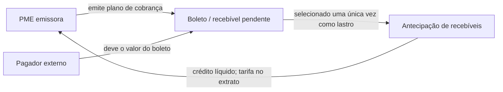

# BaaS PME API

API do desafio QI Tech para uma pequena empresa cobrar mensalidades, movimentar
caixa e antecipar recebíveis. Valores monetários são sempre inteiros em
centavos e toda rota, exceto `/` e `/health_check`, exige `INTERNAL-TOKEN`.
Usuários remotos também podem enviar JWT em `Authorization: Bearer`; nesse caso
a sessão e o papel na PME são validados antes do acesso à conta.

A arquitetura entregue é um serviço HTTP modular e um worker de outbox com
código/banco compartilhados. O Compose é de desenvolvimento (reload, portas
locais e credenciais demonstrativas); não inclui API Gateway. Serviços com
`INTERNAL-TOKEN` têm autoridade ampla. A fronteira pública futura precisa impor
JWT e restringir provisionamento/políticas diretas, sem revelar token interno.

Os contratos são mantidos em [../docs/RFC.md](../docs/RFC.md) e
[../docs/DECISOES.md](../docs/DECISOES.md). Eles são a referência para regras
de negócio, payloads, códigos `QIT` e respostas de erro.

## Dois fluxos, dois propósitos

O produto não trata antecipação como empréstimo.



- **Plano de cobrança:** a PME solicita a emissão de 12 boletos para cobrar
  seus próprios pagadores. A API registra o recebível e sua emissão; não
  baixa automaticamente o boleto nem movimenta o dinheiro do pagador.
- **Antecipação de recebíveis:** a PME seleciona de 1 a 50 boletos próprios,
  pendentes e ainda não antecipados. A API credita o valor bruto menos a
  tarifa e vincula os boletos ao registro de antecipação no mesmo commit.

**Regra aprovada, implementação pendente P0.4:** uma nova antecipação deve ter
líquido positivo; tarifa maior ou igual ao bruto deve ser recusada, mesmo
com saldo disponível. Para bruto de R$ 100, tarifas de R$ 3/R$ 100/R$ 120
resultam em R$ 97/R$ 0/−R$ 20; os dois últimos casos devem ser recusados.
A API ainda não aplica essa validação em todos os caminhos. O exemplo completo,
cálculo, cotação e critérios de teste estão em
[DECISOES 3.5.1](../docs/DECISOES.md#351-líquido-positivo-regra-aprovada-e-implementação-pendente).

Não existem nesta API contrato de empréstimo, principal sem lastro, juros
parcelados, cronograma de amortização ou boleto para um devedor de crédito.

## Subir a aplicação

Pré-requisitos: Git, Docker Engine/Compose v2+, Python 3.11 com venv e curl.

```bash
cd baas-pme-api
docker compose up -d --build
docker compose ps
```

Espere `api` e `db` ficarem `healthy`. A API estará em
`http://localhost:3000` e o MockServer em `http://localhost:1080`.

```bash
curl http://localhost:3000/health_check
```

O retorno é exatamente `204 No Content`. O MockServer fica `Up`, sem healthcheck
próprio. Saúde da API mede liveness e não consulta a disponibilidade do banco.
O `.env` é opcional; personalize com `cp .env.example .env`.

Prepare os testes no ambiente virtual da própria API:

```bash
python3 -m venv .venv
./.venv/bin/python -m pip install --upgrade pip
./.venv/bin/python -m pip install -r requirements-dev.txt
```

Se preferir ativar: `source .venv/bin/activate`; no Windows PowerShell,
`.venv\Scripts\Activate.ps1` (e comandos com `.venv\Scripts\python.exe`).

## Executar os testes

Os testes de produto são de integração HTTP e usam a API, PostgreSQL e
MockServer do Compose. A suíte também contém contratos de infraestrutura para
triggers, locks e worker, que podem acessar PostgreSQL de forma controlada. A
execução completa inclui a regra noturna, portanto precisa
fixar a hora de teste antes do `pytest`:

```bash
NIGHT_TIME_OVERRIDE=21:00 docker compose up -d --build
./.venv/bin/python -m pytest -q
```

Esse é o perfil adotado pelo CI. A contagem e resultados datados ficam em
[COBERTURA.md](../docs/COBERTURA.md), evitando números desatualizados em guias.
Depois, restaure o relógio normal com `docker compose up -d`.

Apresentamos **garantias verificadas e limitações conhecidas**, não segurança
absoluta. Cada teste sustenta o cenário que exercita; decisões aprovadas e
tarefas planejadas não contam como garantias implementadas.

As evidências também podem ser executadas separadamente:

```bash
./.venv/bin/python -m pytest tests -q -m static_guard
./.venv/bin/python -m pytest tests -q -m api_blackbox
./.venv/bin/python -m pytest tests -q -m infrastructure_contract
./.venv/bin/python -m pytest tests -q -m 'api_blackbox and not legacy'
```

O CI executa as três primeiras seleções após build, liveness e compilação,
em todo push/PR. `static_guard` protege imports e rastreabilidade de
RFC/rotas/tabelas/erros; `api_blackbox` usa somente HTTP; `infrastructure_contract`
inclui SQL, injeção de falhas e subprocesso do worker. Todos evitam importar
módulos internos no processo de teste. Contratos de infraestrutura e testes
legados de listagem recriam/modificam o schema: use **banco local descartável**
e execução sequencial. Um worker contínuo deve estar parado durante esses
testes, pois eles controlam manualmente as entregas.

## Benchmark de concorrência

### Validação final isolada

Para testar sem recriar o schema do seu banco atual:

```bash
bash scripts/validate_delivery.sh --snapshot
```

Cria clone local com snapshot não ignorado, `.venv` nova e Compose com
API/DB/mock em 13000/15432/11080. Executa as três seleções, suíte completa,
métricas e benchmark; remove só containers/volumes descartáveis dessa execução.
O checkout é preservado e os relatórios ficam em `artifacts/delivery/<UTC>/`.
Não equivale a clone remoto/VM virgem ou teste por outra pessoa. Depois do
commit, `--head` testa somente o conteúdo commitado. Comandos, artefatos PDF
e limites estão em [ENTREGA](../docs/entrega/ENTREGA.md).

### Carga canônica

Para repetir a carga S7c canônica (cinco repetições de 40 transferências
cruzadas), com duração, versões, amostras ociosas e `docker stats` sob carga:

```bash
./scripts/benchmark_concurrency.sh
```

O resultado fica em `artifacts/benchmarks/<UTC>/`, ignorado pelo Git por ser
dependente da máquina. Leia [../docs/BENCHMARK.md](../docs/BENCHMARK.md) antes
de comparar números: a referência é evidência contextual, não um SLO.

## Recriar o banco após alterar SQL

`database/database.sql` é copiado para a imagem do PostgreSQL durante o build.
Por isso, alterar apenas o arquivo não atualiza uma imagem já existente. O
comando necessário é:

```bash
docker compose down -v && docker compose up -d --build
```

`down -v` apaga os dados locais do banco; use apenas quando esse descarte for
intencional.

## Rotas do produto

| Método | Caminho | Finalidade |
|---|---|---|
| `POST` / `GET` | `/customer`, `/customer/{customer_key}` | Cadastro e consulta de cliente. |
| `POST` | `/user` | Cadastro de usuário e vínculo inicial com a PME. |
| `POST` | `/auth/login`, `/auth/refresh`, `/auth/logout` | Sessão por dispositivo, JWT curto, rotação de refresh e revogação individual. |
| `GET` | `/audit-events`, `/audit-events/checkpoint` | Exportação da trilha append-only e ponta da cadeia SHA-256. |
| `GET` | `/metrics` | Métricas Prometheus internas de operação. |
| `POST` / `GET` | `/account`, `/account/{account_key}` | Abertura e consulta de conta. |
| `PUT` | `/account/{account_key}/block`, `/cancel` | Ciclo de vida auditável da conta. |
| `POST` / `GET` | `/account/{account_key}/transaction`, `/transaction/{transaction_key}` | Depósito, saque, transferência e consulta de lançamento. |
| `GET` | `/account/{account_key}/transactions` | Extrato paginado. |
| `POST` / `GET` | `/account/{account_key}/billing-plan`, `/billing-plan/{plan_key}` | Emissão e consulta de boletos. |
| `POST` | `/account/{account_key}/billing-plan/{plan_key}/adjustment` | Emissão do lote reajustado. |
| `POST` | `/account/{account_key}/credit-advance` | Antecipação lastreada em boletos. |
| `POST` | `/pricing-policy` | Publicação interna de tarifa padrão ou específica por PME. |
| `POST` | `/risk-policy` | Publicação interna de habilitações e limites de risco por PME. |
| `POST` | `/account/{account_key}/quote` | Prévia de tarifa, líquido e limites para transferência, cobrança ou antecipação. |
| `POST` / `PUT` | `/policy-change-request`, `/{key}/submit`, `/{key}/approve` | Proposta de política por PME e aprovação por outro OWNER. |

## Alterações comerciais com quatro olhos

Uma condição comercial específica de PME deve nascer como proposta em
`DRAFT`, ser submetida a `PENDING_APPROVAL` e receber aprovação de outro
usuário `OWNER` autenticado por JWT. Propostas pendentes não entram nos
resolvedores de preço ou risco; ao aprovar, a API publica uma nova versão e
registra criador, aprovador e evento na trilha auditável.

As rotas `/pricing-policy` e `/risk-policy` continuam como bootstrap técnico
e podem publicar diretamente, contornando aprovação. Nenhum gateway no Compose
impõe a restrição de uso; o controle de quatro olhos vale para o fluxo de propostas.

## Cotação antes da confirmação

`POST /account/{account_key}/quote` retorna uma prévia auditável, válida por
60 segundos, de preço e risco para `TRANSFER`, `BILLING_PLAN` ou
`CREDIT_ADVANCE`. Ela não reserva saldo, limite, boleto nem tarifa. Por isso,
as rotas financeiras não aceitam `quote_key` ou `fee_amount`: elas recalculam
as políticas vigentes no commit. Essa escolha mantém o ledger autoritativo
mesmo quando a regra comercial muda entre a tela de confirmação e o envio.

Depósito, saque, transferência e antecipação exigem `Idempotency-Key`. Uma
repetição com o mesmo payload devolve `201` e `Idempotent-Replayed: true` sem
duplicar o ledger.

## Logs e métricas

Logs normais da aplicação são JSON no stdout, correlacionados por `request_id`,
sem corpo de requisição e com chaves de conta/usuário mascaradas. Erros
inesperados podem incluir diagnóstico SQL/URLs em traceback da aplicação ou
do Uvicorn; sanitização universal está pendente em P1.11 e não deve ser
prometida como entregue. Para consultar métricas Prometheus localmente:

```bash
curl -H 'INTERNAL-TOKEN: default_token' http://localhost:3000/metrics
```

Os rótulos das métricas não incluem dados pessoais, UUIDs, IPs ou query
strings; use a rota-modelo, status e código QIT para agregação.

O registry HTTP é por processo e reinicia com a API; gauges de sessões/outbox
são derivados do banco. Prometheus, Alertmanager e cAdvisor não são serviços
deste Compose; `docker stats` fornece as amostras locais do benchmark.

## Notificações confiáveis

Bloquear ou cancelar uma conta cria uma notificação na `outbox_event` no mesmo
commit do status e da auditoria. A requisição HTTP nunca chama webhook: o
processo separado faz isso depois. Para ativá-lo localmente:

```bash
docker compose --profile workers up -d outbox-worker
```

Ou processe somente um lote, útil para diagnóstico:

```bash
docker compose --profile workers run --rm outbox-worker --once
```

O webhook recebe `Idempotency-Key` igual ao `event_key`. A garantia é entrega
**pelo menos uma vez**: o consumidor deve deduplicar essa chave. Falhas ficam
na outbox com backoff exponencial; sucesso não é reenviado. As regras
Prometheus para 5xx, conectores, lock, fila e falhas de entrega estão em
[../docs/ALERTAS.md](../docs/ALERTAS.md).

## Timeouts e repetição segura

Chamadas externas usam 1 segundo para conexão e 5 segundos para leitura;
falhas nelas retornam `502 QIT001009`. A transação PostgreSQL recebe limites
locais de 2 segundos para trava e 10 segundos para execução; se esgotar,
retorna `503 QIT001024`. Cada resposta preserva `X-Request-ID` para
correlação. O orçamento de 15 segundos reduz esses limites quando necessário.

Deadlock ou falha de serialização do PostgreSQL recebe no máximo uma nova
tentativa interna, sempre em sessão/transação nova e com a mesma
`Idempotency-Key`. A API não retenta saldo insuficiente, limite noturno, status
inválido, erros de contrato ou chamadas externas. A métrica
`baas_database_transient_retries_total` registra apenas `deadlock` ou
`serialization`, sem PII.

Se o cliente perder ou interromper a resposta de uma operação financeira, não
deve criar outra chave: deve reenviar exatamente o mesmo payload com a mesma
`Idempotency-Key`. Assim a API devolve o resultado já confirmado ou conclui uma
única vez, sem duplicar o lançamento.

## Configuração

Os valores padrão do Compose permitem iniciar sem `.env`. Para personalizar,
copie `.env.example` para `.env`. As variáveis relevantes são:

| Variável | Padrão | Uso |
|---|---:|---|
| `INTERNAL_TOKEN` | `default_token` | Token interno das rotas protegidas. |
| `JWT_SECRET` | segredo local de desenvolvimento | Chave de assinatura HS256; defina valor secreto fora do repositório em produção. |
| `JWT_ACCESS_TOKEN_MINUTES` | `15` | Vida útil do JWT de acesso. |
| `JWT_SESSION_MAX_HOURS` | `8` | Vida máxima da sessão e de seus refresh tokens. |
| — | — | Tarifas comerciais são políticas versionadas no banco; o seed mantém transferência de 100 centavos e antecipação de 300 bps. |
| `NIGHT_START`, `NIGHT_END` | `20:00`, `06:00` | Janela de limite noturno. |
| `NIGHT_LIMIT_CENTS` | `100000` | Limite noturno por saque ou transferência. |
| `TIMEZONE` | `America/Sao_Paulo` | Fuso do relógio de produção. |
| `NIGHT_TIME_OVERRIDE` | vazio | Hora fixa exclusiva de testes. |
| `BANKSLIP_API_CONNECT_TIMEOUT_SECONDS`, `CENTRAL_BANK_API_CONNECT_TIMEOUT_SECONDS` | `1` | Prazo de conexão dos conectores externos. |
| `BANKSLIP_API_READ_TIMEOUT_SECONDS`, `CENTRAL_BANK_API_READ_TIMEOUT_SECONDS` | `5` | Prazo de leitura dos conectores externos. |
| `DATABASE_LOCK_TIMEOUT_MS` | `2000` | Espera máxima por trava PostgreSQL por transação. |
| `DATABASE_STATEMENT_TIMEOUT_MS` | `10000` | Execução máxima de comando PostgreSQL por transação. |
| `REQUEST_TIMEOUT_SECONDS` | `15` | Orçamento aplicado a esperas conhecidas; não deadline global de cancelamento. |
| `DATABASE_TRANSIENT_RETRY_MAX_ATTEMPTS` | `2` | Total de tentativas para `40P01`/`40001`. |
| `DATABASE_TRANSIENT_RETRY_BASE_DELAY_MS` | `25` | Base do backoff com jitter entre tentativas transitórias. |
| `NOTIFICATION_WEBHOOK_URL` | `http://mock:1080/notifications` | Webhook que recebe eventos da outbox; em produção, serviço de notificações. |
| `OUTBOX_POLL_INTERVAL_SECONDS` | `1` | Intervalo de consulta do worker. |
| `OUTBOX_LEASE_SECONDS` | `30` | Duração do lease de claim; expiração permite retomada e pode causar reentrega. |
| `OUTBOX_RETRY_BASE_SECONDS` | `5` | Base do backoff exponencial após falha de entrega. |

## Estrutura

- `src/resources`: camada HTTP e validação de entrada;
- `src/controllers`: regras de negócio e commits;
- `src/repositories`: consultas e travas PostgreSQL;
- `src/models`: mapeamento SQLAlchemy;
- `src/schemas`: contratos JSON de entrada;
- `tests/integration`: testes de produto por HTTP e contratos de infraestrutura;
- `database/database.sql`: DDL inicial.

As rotas `sample_entity` e seus arquivos continuam no repositório apenas como
legado do projeto-base. Não pertencem ao contrato BaaS PME e não devem ser
usadas por integrações novas.

## Arquitetura, garantias verificadas e limitações conhecidas

```text
HTTP → contexto/log/token/sessão → resource/schema → controller → repository → PostgreSQL
                                              controller → connector → provedor (MockServer em testes)
PostgreSQL outbox → worker → webhook, com transações independentes de claim e confirmação
```

| Tema / decisão | Implementação (dentro de `src/`) | Evidência |
|---|---|---|
| Contrato e erros | `resources/`, `schemas/`, `errors/`, `app.py` | `tests/integration/`, `tests/test_documentation_contract.py` |
| Contexto/rollback/log | `middlewares/`, `database.py`, `utils/request_context.py`, `utils/logger.py` | fumaça, métricas e timeouts |
| Saldo/ledger/locks, D3 | `controllers/transaction_controller.py`, `repositories/account_repository.py`, `repositories/transaction_repository.py` | transação, transferência, extrato, S7a/S7c |
| Replay e retry | `controllers/idempotency_controller.py`, `repositories/idempotency_repository.py`, `utils/transient_retry.py` | idempotência simultânea, falha sintética PostgreSQL |
| Cobrança/reajuste, D2/D5/D6/D9 | `controllers/billing_plan_controller.py`, `connectors/`, `dtos/billing_plan_dto.py` | plano, reajuste, jornada PME |
| Recebíveis, D4 | `controllers/credit_advance_controller.py`, `repositories/credit_advance_repository.py` | antecipação, concorrência, jornada PME |
| Identidade, D10 | `controllers/auth_controller.py`, `utils/authentication.py`, `utils/account_access.py` | auth, senha UTF-8, autorização de cotação |
| Auditoria, D11 | `utils/audit.py`, `repositories/audit_repository.py`, `dtos/audit_event_dto.py` | cadeia HTTP; trigger por SQL em contrato de infraestrutura |
| Observabilidade, D12 | `utils/metrics.py`, `controllers/metrics_controller.py` | métricas; benchmark de runtime |
| Notificação, D13 | `repositories/outbox_repository.py`, `utils/outbox.py`, `workers/outbox_publisher.py` | outbox e MockServer; [alertas](../docs/ALERTAS.md) |
| Preço/risco, D1/D14 | `repositories/pricing_repository.py`, `repositories/risk_policy_repository.py`, controllers correspondentes | precificação, limite diário compartilhado/rollback |
| Cotação/aprovação, D15/D16 | `controllers/quote_controller.py`, `controllers/policy_change_request_controller.py` | quote, maker-checker, duas aprovações concorrentes |
| Persistência | `models/` e `database/database.sql` na raiz da API | bootstrap SQL; DER e guarda documental |
| Representação pública | `dtos/` e respostas dos controllers comerciais | contratos HTTP; UUID nos objetos financeiros |

Regras de preço/risco atualmente residem parcialmente nos repositories e a
auditoria executa SQL em `utils/audit.py`; a separação estrita dessas regras
está no hardening. `session.commit()` é decisão do controller financeiro;
repositories não confirmam transações. O publicador tem commits próprios.

Valores monetários são BIGINT; tarifa percentual é bps inteiro; índices externos
usam Decimal/NUMERIC, nunca float monetário. `audit_event` possui trigger contra
UPDATE/DELETE; ledger, status e snapshots ainda não possuem essa proteção.
SHA-256 torna a exportação verificável, mas a cadeia não resiste a administrador
do banco e sua escrita usa uma trava global. Exportação administrativa inclui
`audit_event_id` sequencial; UUID nos objetos financeiros não substitui RBAC.

O extrato usa offset e não congela histórico entre páginas; reconciliar uma
conta viva exige snapshot/corte consistente futuro. Emissão de boletos não tem
replay persistido de requisição nem transação distribuída com o emissor; pode
haver emissão externa seguida de rollback local. Consulte a revisão em
[COBERTURA.md](../docs/COBERTURA.md) e as tarefas 9.5 do plano.

## Operação diária e diagnóstico

| Ação | Comando dentro de `baas-pme-api/` |
|---|---|
| Subir / conferir / parar | `docker compose up -d`, `docker compose ps`, `docker compose stop` |
| Ver logs / encerrar serviços | `docker compose logs -f api`, `docker compose down` |
| Conferir contrato do Compose | `docker compose config --quiet` |
| Rodar arquivo / observar detalhes | `./.venv/bin/python -m pytest tests/integration/test_healthcheck.py -v` |
| Conferir compilação | `./.venv/bin/python -m compileall -q src` |

O SQL de bootstrap roda apenas no nascimento do banco. Antes de reconstruir
volume/imagem, confirme que seus dados locais podem ser descartados. Para
produção são necessárias migrations; apagar volume não é migração.

Se porta 3000/5432/1080 estiver ocupada, configure `API_PORT`, `DB_PORT`,
`MOCK_PORT` no `.env`; o teste usa o mesmo arquivo, mas `DATABASE_URL` do host
deve refletir `DB_PORT`. Endereço interno do PostgreSQL no Compose continua
`db:5432`. Um `Could not import module app` pede conferir diretório, extensão
`.py`, `docker compose logs api` e, se necessário, `docker compose build --no-cache`.
Healthcheck é consultado periodicamente e seus logs são suprimidos pela aplicação.

Para evidência humana de setup/clone limpo, registre `docker compose ps` e
a saída de pytest; outra pessoa deve repetir os comandos deste README numa
máquina Linux limpa. Execução local bem-sucedida não conclui essa tarefa.

O guia inicial e o guia de organização passaram a apontar para este README;
a navegação e o papel dos documentos estão em [docs/README.md](../docs/README.md).
