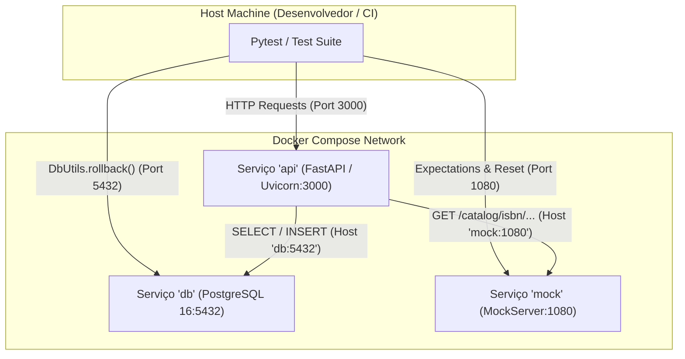
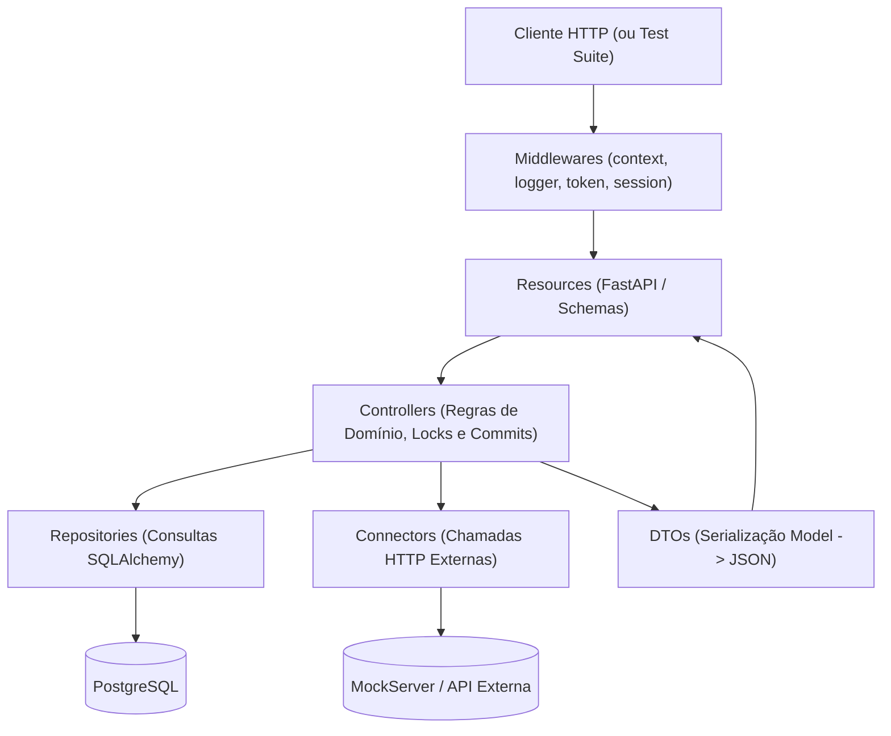

# Documentação Técnica e Arquitetural Completa: `bootcamp-biblioteca-api`

---

## 1. Visão Geral e Árvore Completa do Repositório

O projeto **bootcamp-biblioteca-api** é uma API REST desenvolvida em **Python 3.11** com o microframework **FastAPI** e **SQLAlchemy 2.0**. A aplicação adota arquitetura em camadas bem delimitadas, validação de contratos estritos via **JSON Schema (Draft-07)**, autenticação de tráfego interno por tokens em headers HTTP, rastreamento de requisições com IDs contextuais e testes de integração automatizados que seguem à risca o padrão **Caixa-Preta (Restrição R1)**.

### Árvore Estruturada de Arquivos e Diretórios

```text
bootcamp-biblioteca-api/
├── .env.example                               # Modelo de variáveis de ambiente para execução local
├── .flake8                                    # Configuração de linter e padronização PEP8
├── Dockerfile                                 # Multi-stage Dockerfile para build e execução da API
├── docker-compose.yml                         # Orquestrador local: API, PostgreSQL 16 e MockServer
├── requirements.txt                           # Dependências de produção (versões fixadas)
├── requirements-dev.txt                       # Dependências de teste, cobertura e desenvolvimento
├── README.md                                  # Guia de rotas, payloads de exemplo e comandos úteis
│
├── database/                                  # Infraestrutura de banco de dados
│   ├── Dockerfile                             # Imagem base postgres:16 com carga automática de DDL
│   └── database.sql                           # Script DDL de criação de tabelas, chaves e dados estáticos
│
├── src/                                       # Código-fonte da aplicação
│   ├── app.py                                 # Ponto de entrada, montagem do FastAPI, middlewares e rotas
│   ├── constants.py                           # Variáveis de ambiente com validação obrigatória
│   ├── database.py                            # SQLAlchemy Engine, SessionLocal e ContextVar de sessão
│   ├── connectors/                            # Clientes para chamadas HTTP externas
│   │   ├── __init__.py
│   │   ├── catalog_connector.py               # Integração especializada com a API de Catálogo ISBN
│   │   └── rest_connector.py                  # Cliente base HTTP com timeout, logging e BaseConnectorResponse
│   ├── controllers/                           # Regras de negócio, validações de domínio e transações
│   │   ├── __init__.py
│   │   ├── base_controller.py                 # Conexão contextual com banco de dados e logger de classe
│   │   ├── author_controller.py               # Validação de CPF único e persistência de autores
│   │   ├── book_controller.py                 # Orquestração do livro: catálogo, lotação, status e locks
│   │   ├── member_controller.py               # Cadastro de membros, CPF válido e checagem de e-mail
│   │   └── shelf_controller.py                # Regras de capacidade e unicidade de código de estante
│   ├── dtos/                                  # Data Transfer Objects (Model ORM -> JSON de Resposta)
│   │   ├── __init__.py
│   │   ├── author_dto.py
│   │   ├── book_dto.py                        # Troca de IDs por UUIDs e montagem de status_events
│   │   ├── member_dto.py
│   │   └── shelf_dto.py
│   ├── errors/                                # Sistema customizado de exceções estruturadas (QIException)
│   │   ├── __init__.py
│   │   ├── base_error.py                      # Classes-mãe QIException, ForbiddenNotInternal, unicity check
│   │   ├── custom_errors.py                   # Exceções com código de erro específico (QIT001012 a QIT001025)
│   │   └── handlers.py                        # Exception handlers registrados no FastAPI
│   ├── middlewares/                           # Pipeline de requisição HTTP (ordem de execução em cebola)
│   │   ├── __init__.py
│   │   ├── internal_token.py                  # Barreira de segurança: confere header INTERNAL-TOKEN
│   │   ├── request_context.py                 # Geração/captura de UUID por requisição (X-Request-Id)
│   │   ├── request_logger.py                  # Log de entrada e saída com tempo de resposta em ms
│   │   └── session_manager.py                 # Ciclo de vida da sessão SQLAlchemy (lazy, rollback e close)
│   ├── models/                                # Mapeamento Objeto-Relacional (SQLAlchemy Declarative Base)
│   │   ├── __init__.py
│   │   ├── base.py                            # DeclarativeBase comum
│   │   ├── author.py                          # Tabela author
│   │   ├── book.py                            # Tabela book com ForeignKeys e relationships (selectin)
│   │   ├── book_status.py                     # Tabela de domínio book_status (AVAILABLE, BORROWED)
│   │   ├── book_status_event.py               # Tabela de auditoria/histórico book_status_event
│   │   ├── member.py                          # Tabela member
│   │   └── shelf.py                           # Tabela shelf
│   ├── repositories/                          # Consultas e persistência (SQL puro abstraído via ORM)
│   │   ├── __init__.py
│   │   ├── author_repository.py
│   │   ├── book_repository.py                 # Consultas com SELECT FOR UPDATE, contagens e paginação
│   │   ├── member_repository.py
│   │   └── shelf_repository.py
│   ├── resources/                             # Camada de entrada HTTP (Controladores de Rotas FastAPI)
│   │   ├── __init__.py
│   │   ├── author.py
│   │   ├── book.py
│   │   ├── health_check.py                    # Endpoints / e /health_check (bypass de token e sem banco)
│   │   ├── member.py
│   │   └── shelf.py
│   ├── schemas/                               # Contratos JSON Schema para validação estrutural
│   │   ├── get_authors.json
│   │   ├── get_books.json
│   │   ├── get_members.json
│   │   ├── get_shelves.json
│   │   ├── post_author.json
│   │   ├── post_book.json
│   │   ├── post_member.json
│   │   ├── post_shelf.json
│   │   ├── put_book_borrow.json
│   │   └── put_book_shelf.json
│   └── utils/                                 # Utilitários globais
│       ├── document_number.py                 # Algoritmo de validação de CPF (módulo 11)
│       ├── logger.py                          # Configuração do logging com injeção de request_id
│       ├── request_context.py                 # ContextVar que transporta o UUID da requisição
│       └── schema_handler.py                  # Decorators de validação de schema para Resources
│
└── tests/                                     # Suíte de testes automatizados caixa-preta
    ├── __init__.py
    ├── conftest.py                            # Inicialização do ambiente de teste e load de variáveis .env
    ├── integration/                           # Testes de integração agrupados por domínio
    │   ├── test_healthcheck.py
    │   ├── author/
    │   │   └── test_author.py
    │   ├── book/
    │   │   ├── test_book_create.py
    │   │   ├── test_book_get.py
    │   │   ├── test_book_shelf.py
    │   │   └── test_book_status.py
    │   ├── member/
    │   │   └── test_member.py
    │   └── shelf/
    │       └── test_shelf.py
    └── utils/                                 # Ferramental de suporte a testes HTTP
        ├── __init__.py
        ├── db_utils.py                        # Limpeza de banco via DDL direto (DROP/CREATE SCHEMA)
        ├── mock_generator.py                  # Configurações pré-definidas de respostas do MockServer
        ├── mock_utils.py                      # Cliente HTTP para criar e verificar expectativas no MockServer
        ├── object_generator.py                # Helpers para criação de entidades via chamadas HTTP
        ├── payload_generator.py               # Geração de payloads válidos e inválidos
        ├── random_generator.py                # Gerador de CPFs válidos, números de ISBN e strings randômicas
        ├── request_generator.py               # Funções de requisição HTTP que chamam a API externamente
        ├── requisition.py                     # Wrapper HTTP em cima do pacote requests
        └── singleton.py                       # Padrão Singleton para clientes de teste
```

---

## 2. Infraestrutura e Containerização (Docker)

O ecossistema do projeto foi desenhado para rodar isoladamente através de containers, dispensando qualquer dependência instalada na máquina do desenvolvedor (exceto o próprio Docker e o interpretador Python para acionar o pytest contra os containers).

### 2.1. Análise do `Dockerfile` da API

O arquivo [Dockerfile](file:///home/caire/Downloads/QiTech/Material/AULA%203/bootcamp-biblioteca-api/Dockerfile) aplica o conceito de **Multi-Stage Build** com foco em segurança e otimização de cache:

```dockerfile
# Imagem oficial e pública do Python (Debian Bookworm slim)
FROM python:3.11-slim AS base

# Criação de usuário de sistema sem privilégios e sem diretório home
RUN adduser --system --no-create-home user

# Criação de ambiente virtual isolado dentro do container
ENV VIRTUAL_ENV=/opt/venv
RUN python3 -m venv "$VIRTUAL_ENV"
ENV PATH="$VIRTUAL_ENV/bin:$PATH"

# Separação da instalação de dependências para maximizar o cache do Docker
COPY requirements.txt /requirements.txt
RUN pip install --upgrade pip && pip install -r /requirements.txt

WORKDIR /app
COPY src /app

# Estágio final para execução da API
FROM base AS api
RUN chown -R user /app
USER user

# Servidor ASGI Uvicorn rodando na porta 3000
CMD uvicorn app:app --host 0.0.0.0 --port 3000 --no-server-header
```

#### Principais Pontos Arquiteturais:
1. **Princípio do Menor Privilégio**: A aplicação roda sob o usuário `user` e nunca como `root`, diminuindo vetores de ataque em caso de vulnerabilidades com execução remota de código.
2. **Aproveitamento de Cache de Camadas**: O arquivo `requirements.txt` é copiado e instalado de forma isolada antes da cópia da pasta `src/`. Enquanto as dependências não forem modificadas, o Docker reutiliza integralmente a camada em cache, agilizando o build.
3. **Ofuscação de Assinatura de Servidor**: O parâmetro `--no-server-header` instrui o Uvicorn a não enviar o cabeçalho `Server: uvicorn`, mitigando reconhecimento passivo de versão de software em varreduras de segurança.

---

### 2.2. Detalhamento do `docker-compose.yml`

O arquivo [docker-compose.yml](file:///home/caire/Downloads/QiTech/Material/AULA%203/bootcamp-biblioteca-api/docker-compose.yml) compõe três serviços interconectados em uma rede bridge padrão:



#### Tabela de Configuração dos Serviços:

| Serviço | Imagem / Origem do Build | Portas Mapeadas | Variáveis de Ambiente Relevantes | Healthcheck e Dependências |
| :--- | :--- | :--- | :--- | :--- |
| **`db`** | `build: ./database/.` | `${DB_PORT:-5432}:5432` | `POSTGRES_USER: bootcamp`<br>`POSTGRES_PASSWORD: bootcamp`<br>`POSTGRES_DB: bootcamp` | **Comando**: `pg_isready -U bootcamp -d bootcamp`<br>**Intervalo**: 3s, **Timeout**: 3s, **Retries**: 20 |
| **`mock`** | `mockserver/mockserver:mockserver-5.11.1` | `${MOCK_PORT:-1080}:1080` | Argumentos:<br>`-logLevel ERROR -serverPort 1080 -proxyRemotePort 1080` | Não requer healthcheck explícito |
| **`api`** | `build: .` (target `api`) | `${API_PORT:-3000}:3000` | `DATABASE_URL: postgresql+psycopg2://bootcamp:bootcamp@db:5432/bootcamp`<br>`INTERNAL_TOKEN: ${INTERNAL_TOKEN:-default_token}`<br>`CATALOG_API_URL: http://mock:1080/catalog`<br>`CATALOG_API_INTERNAL_TOKEN: ${CATALOG_API_INTERNAL_TOKEN:-default_token}` | **Comando**: Python chamando `urllib.request.urlopen("http://localhost:3000/health_check")`<br>**Depends on**: `db` com `condition: service_healthy` |

#### Aspectos Importantes do Compose:
* **Dependência Saudável (`condition: service_healthy`)**: A API não tenta iniciar assim que o container `db` é criado; ela aguarda o PostgreSQL estar operacional e aceitando conexões, evitando crashes no boot por falha de banco.
* **Volume Dinâmico em Desenvolvimento**: O volume `- ./src:/app` e o comando com `--reload` no Uvicorn permitem modificar arquivos Python no host e ver a API recarregar imediatamente sem necessidade de rebuild.
* **Resolução Interna de Nomes DNS**: A API comunica-se com o banco através do hostname `db` e com a API externa através do hostname `mock`.

---

### 2.3. Inicialização do Banco de Dados (`database.sql`)

A criação do banco é automatizada pelo [database/Dockerfile](file:///home/caire/Downloads/QiTech/Material/AULA%203/bootcamp-biblioteca-api/database/Dockerfile):
```dockerfile
FROM postgres:16
COPY database.sql /docker-entrypoint-initdb.d/01.sql
```
Qualquer script `.sql` posicionado na pasta `/docker-entrypoint-initdb.d/` de uma imagem oficial do Postgres é processado no primeiro bootstrap do cluster.

O arquivo [database/database.sql](file:///home/caire/Downloads/QiTech/Material/AULA%203/bootcamp-biblioteca-api/database/database.sql) define o esquema relacional:
```sql
CREATE TABLE author(
    id                              SERIAL PRIMARY KEY,
    author_key                      CHAR(36) NOT NULL,
    name                            VARCHAR(255) NOT NULL,
    nationality                     VARCHAR(100) NOT NULL,
    document_number                 CHAR(14) NOT NULL,
    created_at                      TIMESTAMP NOT NULL DEFAULT(NOW()),
    UNIQUE(author_key),
    UNIQUE(document_number)
);

CREATE TABLE shelf(
    id                              SERIAL PRIMARY KEY,
    shelf_key                       CHAR(36) NOT NULL,
    code                            VARCHAR(20) NOT NULL,
    location                        VARCHAR(255) NOT NULL,
    capacity                        INTEGER NOT NULL CHECK (capacity > 0),
    created_at                      TIMESTAMP NOT NULL DEFAULT(NOW()),
    UNIQUE(shelf_key),
    UNIQUE(code)
);

CREATE TABLE member(
    id                              SERIAL PRIMARY KEY,
    member_key                      CHAR(36) NOT NULL,
    name                            VARCHAR(255) NOT NULL,
    email                           VARCHAR(255) NOT NULL,
    document_number                 CHAR(14) NOT NULL,
    created_at                      TIMESTAMP NOT NULL DEFAULT(NOW()),
    UNIQUE(member_key),
    UNIQUE(email),
    UNIQUE(document_number)
);

CREATE TABLE book_status(
    id                              SERIAL PRIMARY KEY,
    enumerator                      VARCHAR(50) NOT NULL,
    created_at                      TIMESTAMP NOT NULL DEFAULT(NOW()),
    UNIQUE(enumerator)
);

-- Carga inicial de semente (seed obrigatória)
INSERT INTO book_status (enumerator) VALUES
('AVAILABLE'),
('BORROWED');

CREATE TABLE book(
    id                              SERIAL PRIMARY KEY,
    book_key                        CHAR(36) NOT NULL,
    status_id                       INTEGER NOT NULL REFERENCES book_status(id),
    author_id                       INTEGER NOT NULL REFERENCES author(id),
    shelf_id                        INTEGER REFERENCES shelf(id),
    member_id                       INTEGER REFERENCES member(id),
    title                           VARCHAR(255) NOT NULL,
    isbn                            CHAR(13) NOT NULL,
    year                            INTEGER NOT NULL,
    pages                           INTEGER NOT NULL,
    created_at                      TIMESTAMP NOT NULL DEFAULT(NOW()),
    UNIQUE(book_key),
    UNIQUE(isbn)
);

CREATE TABLE book_status_event(
    id                              SERIAL PRIMARY KEY,
    book_id                         INTEGER NOT NULL REFERENCES book(id),
    status_id                       INTEGER NOT NULL REFERENCES book_status(id),
    event_datetime                  TIMESTAMP NOT NULL,
    created_at                      TIMESTAMP NOT NULL DEFAULT(NOW())
);
```

---

## 3. Suíte de Testes (TDD e Caixa-Preta — Restrição R1)

A estratégia de testes do projeto segue de forma estrita o conceito de **testes de integração caixa-preta**. 

### 3.1. Restrição R1: Desacoplamento Absoluto do Código da Aplicação
Os testes **não importam nenhuma classe, função ou módulo de `src/`**.
* Não há `from src.models import Book`
* Não há `from src.controllers import BookController`
* Não há `from fastapi.testclient import TestClient` com `from src.app import app`

Em vez de invocar código em memória, os testes atuam como **clientes HTTP externos reais** consumindo a API em rede por meio da biblioteca `requests`.

#### Exemplo do Cliente HTTP Real ([tests/utils/requisition.py](file:///home/caire/Downloads/QiTech/Material/AULA%203/bootcamp-biblioteca-api/tests/utils/requisition.py)):
```python
class ClientRequisition:
    @staticmethod
    def send(
        method,
        endpoint,
        payload=None,
        headers=None,
        data=None,
        cert=None,
        query_params=None,
        verify=True,
    ):
        if headers is None:
            headers = dict()

        api_host = environ.get("SERVER_LOCALHOST", "0.0.0.0")
        api_port = environ.get("API_PORT", "3000")
        base_url = f"http://{api_host}:{api_port}"
        url = f"{base_url}{endpoint}"

        try:
            response = request(
                method.upper(),
                url,
                headers=headers,
                json=payload,
                data=data,
                cert=cert,
                verify=verify,
                params=query_params,
            )
        except RequestsConnectionError:
            raise RuntimeError(API_OFFLINE.format(base_url=base_url)) from None

        return BaseConnectorResponse(
            endpoint=endpoint,
            method=method,
            payload=payload,
            headers=headers,
            response=response,
        )
```

O arquivo [tests/utils/request_generator.py](file:///home/caire/Downloads/QiTech/Material/AULA%203/bootcamp-biblioteca-api/tests/utils/request_generator.py) mapeia cada rota exposta da API injetando automaticamente o header de autenticação interna:
```python
class RequestGenerator:
    @staticmethod
    def POST_book(book_payload: dict):
        response = ClientRequisition.send(
            "POST",
            "/book",
            payload=book_payload,
            headers={"INTERNAL-TOKEN": INTERNAL_TOKEN},
        )
        return response.response_status, response.response_json
```

---

### 3.2. Ciclo de Vida do Banco de Dados e Limpeza entre Execuções

Em testes integrados caixa-preta, a persistência de dados em um banco real pode gerar efeito colateral entre testes. O projeto resolve isso via [tests/utils/db_utils.py](file:///home/caire/Downloads/QiTech/Material/AULA%203/bootcamp-biblioteca-api/tests/utils/db_utils.py):

```python
RESET_QUERIES = [
    "DROP SCHEMA public CASCADE;",
    "CREATE SCHEMA public;",
    "GRANT ALL ON SCHEMA public TO CURRENT_USER;",
    "GRANT ALL ON SCHEMA public TO public;",
]

PROJECT_ROOT = Path(__file__).resolve().parents[2]
SCHEMA_FILE = PROJECT_ROOT / "database" / "database.sql"

class DbUtils:
    @staticmethod
    def rollback() -> None:
        engine = create_engine(DbUtils.database_url(), isolation_level="AUTOCOMMIT")

        try:
            with engine.connect() as connection:
                # 1. Destrói completamente o schema public e seus objetos
                for query in RESET_QUERIES:
                    connection.exec_driver_sql(query)

                # 2. Executa novamente o DDL oficial recriando tabelas e seeds
                connection.exec_driver_sql(SCHEMA_FILE.read_text())
        finally:
            engine.dispose()
```

#### Política de Execução da Limpeza:
* **Execução Sob Demanda**: O reset **não** roda em todos os testes por padrão para economizar tempo de execução. Testes que trabalham com UUIDs randômicos e asserções direcionadas a registros específicos coexistem no mesmo banco.
* **Testes com Contagem e Paginação**: Sempre que um teste precisa garantir tamanho exato de páginas ou ausência de registros (ex.: `test_list_books_empty` ou `test_pagination`), a primeira instrução do teste é:
  ```python
  DbUtils.rollback()
  ```

---

### 3.3. Testando Interações Externas com MockServer

Para validar cenários de integração externa sem depender de serviços terceiros na internet, os testes configuram o container do MockServer antes de chamar a API:

```python
class TestBookCreate:
    def test_creates_book_with_catalog_data(self):
        # 1. Limpa expectativas anteriores no MockServer
        Mock().clear()

        # 2. Prepara massa de dados auxiliar via API
        author_key = ObjectGenerator.create_author()["author_key"]
        isbn = RandomGenerator.generate_isbn()

        # 3. Ensina o MockServer a responder 200 para a consulta daquele ISBN
        CatalogMock.GET_isbn(isbn=isbn)

        # 4. Executa a chamada HTTP real contra a API da biblioteca
        payload = PayloadGenerator.create_book_payload(author_key, isbn=isbn)
        status, response = RequestGenerator.POST_book(payload)

        # 5. Validações de resposta
        assert status == 201
        assert response["status"] == "AVAILABLE"

        # 6. Auditoria de borda: confirma que a API chamou o MockServer exatamente 1 vez com o token correto
        received_requests = Mock().retrieve_requests("GET", f"/catalog/isbn/{isbn}")
        assert len(received_requests) == 1
        assert received_requests[0]["headers"]["INTERNAL-TOKEN"] != [""]
```

---

## 4. Mapeamento das Camadas e Integrações

A arquitetura do `src/` adota o princípio de responsabilidade única dividido em camadas estritas:



---

### 4.1. Camada de Integração (Connectors)

A comunicação com APIs de fora da biblioteca é centralizada no pacote `src/connectors/`:

#### [src/connectors/rest_connector.py](file:///home/caire/Downloads/QiTech/Material/AULA%203/bootcamp-biblioteca-api/src/connectors/rest_connector.py)
Classe abstrata que padroniza o protocolo HTTP para qualquer integração futura:
* Injeta o cabeçalho `INTERNAL-TOKEN`.
* Mede o tempo de resposta em milissegundos e loga os passos `OUTGOING REQUEST` e `INCOMING RESPONSE`.
* Define obrigatoriedade de `timeout` para não travar workers do servidor ASGI.
* Envelopa a resposta crua em uma instância de `BaseConnectorResponse`, tratando com segurança falhas de parsing de JSON (ex.: respostas HTML ou status 204).

#### [src/connectors/catalog_connector.py](file:///home/caire/Downloads/QiTech/Material/AULA%203/bootcamp-biblioteca-api/src/connectors/catalog_connector.py)
Especialização do cliente para a API de livros:
```python
class CatalogConnector(RestConnector):
    def __init__(self) -> None:
        super().__init__(
            class_name=__name__,
            base_url=CATALOG_API_URL,
            timeout=5,  # 5 segundos de prazo limite
            internal_token=CATALOG_API_INTERNAL_TOKEN,
        )

    def get_by_isbn(self, isbn: str) -> BaseConnectorResponse:
        return self.send(endpoint=f"/isbn/{isbn}", method="GET")
```
* **Decisão de Design**: O conector não lança exceções de negócio em caso de status 404 ou 500; ele devolve o objeto de resposta. A interpretação semântica do retorno é papel exclusivo do controller.

---

### 4.2. Resources e Schemas

Os arquivos em `src/resources/` são os pontos de entrada HTTP do FastAPI. Eles realizam duas tarefas:
1. Validar a entrada sintática (payloads e query params) contra o JSON Schema.
2. Delegar o processamento ao respectivo controller e retornar uma `JSONResponse`.

#### Tabela de Endpoints, Verbos e Schemas

| Rota | Verbo | Resource | Schema de Validação | Descrição |
| :--- | :---: | :--- | :--- | :--- |
| `/` | `GET` | [HealthCheckResource](file:///home/caire/Downloads/QiTech/Material/AULA%203/bootcamp-biblioteca-api/src/resources/health_check.py) | *Nenhum* | Retorna status da aplicação |
| `/health_check` | `GET` | [HealthCheckResource](file:///home/caire/Downloads/QiTech/Material/AULA%203/bootcamp-biblioteca-api/src/resources/health_check.py) | *Nenhum* | Healthcheck lido pelo Docker |
| `/author` | `POST` | [AuthorResource](file:///home/caire/Downloads/QiTech/Material/AULA%203/bootcamp-biblioteca-api/src/resources/author.py) | `post_author.json` | Cadastro de autor |
| `/author/{author_key}` | `GET` | [AuthorResource](file:///home/caire/Downloads/QiTech/Material/AULA%203/bootcamp-biblioteca-api/src/resources/author.py) | *Nenhum* | Busca de autor por UUID |
| `/authors` | `GET` | [AuthorResource](file:///home/caire/Downloads/QiTech/Material/AULA%203/bootcamp-biblioteca-api/src/resources/author.py) | `get_authors.json` | Listagem paginada |
| `/shelf` | `POST` | [ShelfResource](file:///home/caire/Downloads/QiTech/Material/AULA%203/bootcamp-biblioteca-api/src/resources/shelf.py) | `post_shelf.json` | Cadastro de estante com capacidade |
| `/shelf/{shelf_key}` | `GET` | [ShelfResource](file:///home/caire/Downloads/QiTech/Material/AULA%203/bootcamp-biblioteca-api/src/resources/shelf.py) | *Nenhum* | Busca de estante por UUID |
| `/shelves` | `GET` | [ShelfResource](file:///home/caire/Downloads/QiTech/Material/AULA%203/bootcamp-biblioteca-api/src/resources/shelf.py) | `get_shelves.json` | Listagem paginada |
| `/member` | `POST` | [MemberResource](file:///home/caire/Downloads/QiTech/Material/AULA%203/bootcamp-biblioteca-api/src/resources/member.py) | `post_member.json` | Cadastro de membro/leitor |
| `/member/{member_key}` | `GET` | [MemberResource](file:///home/caire/Downloads/QiTech/Material/AULA%203/bootcamp-biblioteca-api/src/resources/member.py) | *Nenhum* | Busca de membro por UUID |
| `/members` | `GET` | [MemberResource](file:///home/caire/Downloads/QiTech/Material/AULA%203/bootcamp-biblioteca-api/src/resources/member.py) | `get_members.json` | Listagem paginada |
| `/book` | `POST` | [BookResource](file:///home/caire/Downloads/QiTech/Material/AULA%203/bootcamp-biblioteca-api/src/resources/book.py) | `post_book.json` | Criação de livro via catálogo externo |
| `/book/{book_key}` | `GET` | [BookResource](file:///home/caire/Downloads/QiTech/Material/AULA%203/bootcamp-biblioteca-api/src/resources/book.py) | *Nenhum* | Detalhe do livro com `status_events` |
| `/books` | `GET` | [BookResource](file:///home/caire/Downloads/QiTech/Material/AULA%203/bootcamp-biblioteca-api/src/resources/book.py) | `get_books.json` | Listagem com filtro opcional `shelf_key` |
| `/book/{book_key}/shelf`| `PUT` | [BookResource](file:///home/caire/Downloads/QiTech/Material/AULA%203/bootcamp-biblioteca-api/src/resources/book.py) | `put_book_shelf.json` | Alocação/troca de estante |
| `/book/{book_key}/borrow`| `PUT`| [BookResource](file:///home/caire/Downloads/QiTech/Material/AULA%203/bootcamp-biblioteca-api/src/resources/book.py) | `put_book_borrow.json`| Empréstimo para um membro |
| `/book/{book_key}/return`| `PUT`| [BookResource](file:///home/caire/Downloads/QiTech/Material/AULA%203/bootcamp-biblioteca-api/src/resources/book.py) | *Nenhum* | Devolução do livro à biblioteca |

#### Exemplo de JSON Schema ([src/schemas/post_book.json](file:///home/caire/Downloads/QiTech/Material/AULA%203/bootcamp-biblioteca-api/src/schemas/post_book.json)):
```json
{
  "title": "PostBook",
  "type": "object",
  "properties": {
    "isbn": {
      "type": "string",
      "pattern": "^\\d{13}$"
    },
    "author_key": {
      "type": "string",
      "minLength": 1,
      "maxLength": 36
    },
    "shelf_key": {
      "type": "string",
      "minLength": 1,
      "maxLength": 36
    }
  },
  "required": [
    "isbn",
    "author_key"
  ],
  "additionalProperties": false
}
```
* A propriedade `additionalProperties: false` impede propriedades espúrias no corpo.
* A regex `^\\d{13}$` garante que requisições com ISBN fora de formato falhem com erro `400 Bad Request` antes de qualquer processamento ou consulta no banco.

---

### 4.3. Pipeline de Middlewares e Ciclo de Sessão

Em [src/app.py](file:///home/caire/Downloads/QiTech/Material/AULA%203/bootcamp-biblioteca-api/src/app.py#L103-L106), a ordem de registro dos middlewares segue a lógica inversa da execução do FastAPI (casca de cebola):

```python
register_session_manager_middleware(application)
register_internal_token_middleware(application)
register_request_logger_middleware(application)
register_request_context_middleware(application)
```

A ordem real de encontro da requisição ao chegar na API é:
1. **`request_context`**: Atribui um identificador único à requisição (`X-Request-Id`).
2. **`request_logger`**: Registra no log a entrada e o tempo decorrido ao sair.
3. **`internal_token`**: Bloqueia requisições sem o token correto com `403 Forbidden` (exceto `/` e `/health_check`).
4. **`session_manager`**: Prepara o contexto de banco.

#### Gerenciamento da Sessão ([src/middlewares/session_manager.py](file:///home/caire/Downloads/QiTech/Material/AULA%203/bootcamp-biblioteca-api/src/middlewares/session_manager.py)) e ([src/database.py](file:///home/caire/Downloads/QiTech/Material/AULA%203/bootcamp-biblioteca-api/src/database.py))
* **Sessão Preguiçosa (Lazy Initialization)**: O middleware chama `open_context()`, mas a conexão com o banco não é aberta imediatamente. Ela só é instanciada se algum Controller for executado e invocar `context.get_or_create_session()`.
* **Sem Commit no Middleware**: O middleware **nunca** executa `commit()`. O commit é dado explicitamente pelo controller quando a regra de negócio completa com sucesso.
* **Segurança no Finally**: O middleware executa `rollback()` se houver exceções não tratadas e sempre executa `close()` no `finally`, prevenindo vazamento de conexões no pool do SQLAlchemy.

---

### 4.4. Controllers e Repositories (Regras de Domínio vs Persistência)

#### Separação de Responsabilidades
* **Repository**: Tem como único objetivo executar consultas SQL via ORM. Não emite commits e não valida regras de negócio.
* **Controller**: Contém as decisões de negócio, manipulação de concorrência com travas pessimistas, validações e encerramento de transações (`self.session.commit()`).

#### Padrão de Prevenção de Condições de Corrida ([src/controllers/book_controller.py](file:///home/caire/Downloads/QiTech/Material/AULA%203/bootcamp-biblioteca-api/src/controllers/book_controller.py)):

##### 1. Controle de Capacidade da Estante:
Para evitar que duas requisições concorrentes insiram livros em uma estante com apenas 1 vaga disponível, a consulta da estante aplica lock pessimista no banco:
```python
def _check_capacity(self, shelf: Shelf) -> None:
    # Emite SELECT ... FOR UPDATE na linha da estante
    locked_shelf = self.shelf_repository.get_by_key_for_update(shelf.shelf_key)

    occupancy = self.book_repository.count_by_shelf(locked_shelf)

    if occupancy >= locked_shelf.capacity:
        raise ShelfFull(locked_shelf.code, locked_shelf.capacity)
```
Qualquer outra requisição concorrente para a mesma estante aguarda até que o `commit` da primeira requisição ocorra.

##### 2. Empréstimo Concorrente do Mesmo Livro:
```python
def borrow(self, book_key: str, member_key: str) -> dict:
    member = self.member_repository.get_by_key(member_key)
    if member is None:
        raise NotFoundMember(member_key)

    # SELECT ... FOR UPDATE no registro do livro
    book = self._get_locked_book(book_key)

    return self._change_status(book, BookStatus.AVAILABLE, BookStatus.BORROWED, member)
```
Se duas requisições tentarem emprestar o mesmo livro simultaneamente, a segunda aguarda a liberação do lock e, ao ler o status como `BORROWED`, rejeita a operação com erro `409 Conflict` (`InvalidBookStatus`), garantindo que o livro não seja entregue a dois membros.

---

### 4.5. Models e DTOs (Mapeamento Relacional e Transformação)

#### Modelo de Dados: Chaves Internas vs Chaves Externas
* **`id` (SERIAL / Integer)**: Usado internamente como chave primária e como alvo de `ForeignKeys` (`author_id`, `shelf_id`, `member_id`, `status_id`). Otimiza índices, joins e performance no Postgres.
* **`_key` (CHAR(36) / UUID4)**: Identificador único exposto para fora da API. Impede ataques de enumeração horizontal e oculta a quantidade real de registros da aplicação.

#### Model do Livro ([src/models/book.py](file:///home/caire/Downloads/QiTech/Material/AULA%203/bootcamp-biblioteca-api/src/models/book.py)):
```python
class Book(Base):
    __tablename__ = "book"

    id = Column(Integer, primary_key=True)
    book_key = Column(CHAR(36), nullable=False)
    status_id = Column(Integer, ForeignKey(BookStatus.id), nullable=False)
    author_id = Column(Integer, ForeignKey(Author.id), nullable=False)
    shelf_id = Column(Integer, ForeignKey(Shelf.id), nullable=True)
    member_id = Column(Integer, ForeignKey(Member.id), nullable=True)
    title = Column(String(255), nullable=False)
    isbn = Column(CHAR(13), nullable=False)
    year = Column(Integer, nullable=False)
    pages = Column(Integer, nullable=False)
    created_at = Column(DateTime, nullable=False, server_default=func.now())

    # Prevenção do problema N+1 com lazy="selectin"
    status = relationship("BookStatus", foreign_keys=[status_id], lazy="selectin")
    author = relationship("Author", foreign_keys=[author_id], lazy="selectin")
    shelf = relationship("Shelf", foreign_keys=[shelf_id], lazy="selectin")
    member = relationship("Member", foreign_keys=[member_id], lazy="selectin")

    status_events = relationship(
        "BookStatusEvent",
        back_populates="book",
        order_by="asc(BookStatusEvent.event_datetime)",
    )
```

#### DTO e Transformação de Resposta ([src/dtos/book_dto.py](file:///home/caire/Downloads/QiTech/Material/AULA%203/bootcamp-biblioteca-api/src/dtos/book_dto.py)):
O DTO isola a entidade do ORM e projeta o formato final que o cliente recebe:
```python
class BookDTO:
    @staticmethod
    def obj_to_dict(book: Book) -> dict:
        dto = BookDTO.obj_to_simplified_dict(book)
        dto["status_events"] = []

        # Converte o histórico de eventos em lista ordenada
        for status_event in book.status_events:
            dto["status_events"].append({
                "status": status_event.status.enumerator,
                "event_datetime": status_event.event_datetime.isoformat(),
            })

        return dto

    @staticmethod
    def obj_to_simplified_dict(book: Book) -> dict:
        return {
            "book_key": book.book_key,
            "title": book.title,
            "isbn": book.isbn,
            "year": book.year,
            "pages": book.pages,
            "author_key": book.author.author_key,
            "shelf_key": book.shelf.shelf_key if book.shelf else None,
            "status": book.status.enumerator,
            "member_key": book.member.member_key if book.member else None,
        }
```
* **Performance em Listagens**: A listagem de livros (`GET /books`) invoca `obj_to_simplified_dict`, suprimindo os `status_events` para poupar I/O e queries adicionais. Apenas a consulta individual por chave (`GET /book/{book_key}`) carrega a trilha histórica completa de eventos.

---

## 5. Resumo Geral das Tecnologias e Decisões de Design

| Pilar | Tecnologia / Estratégia Adotada | Justificativa de Engenharia |
| :--- | :--- | :--- |
| **API Framework** | FastAPI (com Uvicorn) | Alto desempenho assíncrono, pipeline robusto de middlewares e compatibilidade nativa ASGI. |
| **Persistência** | SQLAlchemy 2.0 + psycopg2-binary | Mapeamento ORM explícito, controle transacional refinado e suporte a locks pessimistas (`SELECT FOR UPDATE`). |
| **Gerenciamento de Transações** | `session_manager` middleware + `ContextVar` | Desacopla a assinatura das rotas, garantindo abertura sob demanda, rollback em falhas e fechamento garantido no `finally`. |
| **Validação de Entrada** | JSON Schema (Draft-07) via `jsonschema` | Contratos estritos de payload e query parameters, rejeitando campos excedentes e formatos inválidos antes da camada de domínio. |
| **Integração Externa** | `RestConnector` + `CatalogConnector` | Timeout compulsório, rastreamento métrico em logs e isolamento de dependências externas. |
| **Testes Automatizados** | Pytest + Requests (Black-Box / R1) | Testes executados contra a aplicação rodando via Docker, garantindo que o comportamento externo e os contratos da API permaneçam idênticos a uma chamada em produção. |
| **Mocking de Terceiros** | MockServer oficial em container | Simulação determinística de quedas de rede, timeouts, erros 500 e dados dinâmicos do catálogo de ISBN sem internet. |
