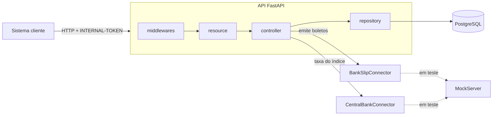

# RFC: BaaS PME, conta, cobrança e liquidez para pequenas empresas

| | |
|---|---|
| **Time** | Cairê Belo · \<nome 2\> · \<nome 3\> |
| **Versão** | 2.1 — checkpoint T3.1 |

## Contextualização

### Entendendo o problema

Uma PME urbana (academia, escola, consultoria) vive de um ciclo curto: cobra mensalidades, recebe, paga fornecedores e, quando o caixa aperta antes de o boleto vencer, precisa de dinheiro na hora. O BaaS PME é o serviço que sustenta esse ciclo para outros sistemas, que o chamam com um token interno. Ele cadastra o cliente e abre a conta, move dinheiro (depósito, saque e transferência com tarifa), emite um plano de boletos reajustado pela inflação, antecipa boletos a receber e entrega um extrato paginado.

A garantia sobre o dinheiro é tripla: o saldo nunca fica negativo nem diverge da soma do extrato; uma operação repetida por falha de rede não é executada duas vezes; nenhum lançamento some. Se falhar, o saldo diverge (a PME paga o que não tem), a transação duplica (o fornecedor recebe duas vezes), o extrato não reconstrói o saldo (a auditoria não consegue explicar o que aconteceu) ou um boleto é antecipado duas vezes (dinheiro criado do nada).

Para saques e transferências, a janela noturna vai de 20h a 6h do dia seguinte, no fuso `America/Sao_Paulo`. Nesse período, cada operação pode movimentar no máximo 100000 centavos (R$ 1.000,00), refletindo o limite padrão aplicado a transferências noturnas como Pix e TED para pessoas físicas. Depósitos não têm esse limite. Os testes automatizados precisam controlar relógio ou configuração para exercitar a regra sem depender do horário de execução.

Fora do escopo: pagamento e baixa de boletos, estorno, múltiplas moedas, autenticação de usuário final e qualquer rotina agendada. O bloqueio e o cancelamento de conta pertencem ao escopo: o bloqueio é exposto por HTTP para tornar a máquina de estados testável; cancelamento é uma transição de status auditável, sem remoção física de dados.

### Estado deste checkpoint

Esta versão cobre as entregas S1, S2, S2b, S3, S4, S5, S6, S7a, S7b, S7c, S8, S9 e S10. A concorrência avançada é provada por HTTP contra PostgreSQL: 40 transferências cruzadas, dez reenvios simultâneos da mesma chave de idempotência, duas antecipações do mesmo boleto e duas transferências disputando o último saldo, todos repetidos cinco vezes. A regra noturna é aplicada pelo controller antes de disputar a trava de saldo; o relógio real usa `TIMEZONE` e o ambiente de teste pode fixar apenas a hora com `NIGHT_TIME_OVERRIDE`.

### Explicando a solução de forma macro

O dinheiro entra por duas portas (depósito e antecipação) e sai por duas (saque e transferência). Cada movimento vira uma linha imutável em um livro-razão (*ledger*) em centavos inteiros, inspirado no registro *append-only* e nas unidades indivisíveis do Bitcoin (o satoshi). O saldo da conta é um cache dessa soma, atualizado somente dentro da mesma transação que grava a linha, com a conta travada. O boleto é o recebível: o plano de cobrança emite os boletos, e a antecipação troca boletos pendentes por saldo, descontando 3%, marcando cada boleto como antecipado para que ele não valha duas vezes. Quatro forças moldam o desenho: (1) a correção do saldo vale mais que a latência, por isso a trava é pessimista; (2) retentativa é normal, por isso a `Idempotency-Key` é garantida por um `UNIQUE` no banco; (3) tudo precisa ser reconstruível, por isso nada é apagado e todo status tem evento; (4) serviço externo cai, por isso nenhuma chamada externa acontece com a conta travada e toda falha externa vira `502` sem gravar nada. O código segue as camadas do repositório-base: o *resource* fala HTTP, o *controller* decide e confirma, o *repository* só consulta. Tudo sobe com `docker compose up` (API, PostgreSQL e MockServer dos conectores) e a suíte `pytest` conversa apenas por HTTP.



Alternativas consideradas e descartadas:

- **Lock otimista** (coluna `version` e retentativa): descartado porque, sob disputa na mesma conta, devolve erro ao cliente ou repete a operação inteira, e uma transferência mexe em duas contas e três lançamentos, o que torna repetir caro. Ganharia se a disputa por conta fosse rara e repetir fosse barato.
- **`NUMERIC(14,2)` em vez de centavos inteiros**: seria correto também, mas deixa o arredondamento implícito no banco e o JSON voltaria a carregar decimais, com risco de virarem `float` no cliente. Ganharia se precisássemos de frações de centavo (câmbio, juros proporcionais).
- **Soft delete** (`is_deleted`): descartado porque esconde a linha em vez de preservar a história, quebra `UNIQUE` e não registra quando e por que mudou. Ganharia se existisse obrigação de apagar dado pessoal (LGPD), caso em que o certo seria anonimizar, o que está fora do escopo.
- **Reajuste por rotina agendada** (cron ou worker): descartado porque roda fora do ciclo da requisição, e a suíte de caixa-preta só enxerga o que o HTTP mostra: não há como forçar nem esperar a rotina. Ganharia se o volume de planos exigisse processar milhares deles em lote na madrugada.

## Implementação

### Rotas

Convenção de status: `400` formato inválido (corpo, parâmetro ou cabeçalho); `403` token ausente ou errado; `404` recurso inexistente ou que não pertence ao chamador (nunca `403`, para não revelar que existe); `409` conflito com o estado atual (duplicado, status, chave reutilizada); `422` pedido bem formado que viola regra de negócio; `502` falha em serviço externo. Todas as rotas, menos `/` e `/health_check`, exigem o cabeçalho `INTERNAL-TOKEN`; sem ele, ou com valor errado, a resposta é `403 QIT000002`. Valores monetários são sempre inteiros em centavos.

| Método | Caminho | O que faz | Entrada (campos que importam) | Saídas (status e quando) |
|---|---|---|---|---|
| `GET` | `/` | Identifica o serviço. Aberta, sem token | n/a | `200` |
| `GET` | `/health_check` | Diz se está de pé (usada pelo healthcheck do compose). Aberta | n/a | `204` |
| `POST` | `/customer` | Cadastra a PME. Repetir não cria outra: `UNIQUE(document_number)` e `UNIQUE(email)` | `name`, `email`, `document_number` (CPF ou CNPJ com máscara) | `201` com `customer_key`; `400 QIT000001` corpo fora do formato; `409 QIT001003` documento já cadastrado; `409 QIT001004` e-mail já cadastrado; `422 QIT001010` dígitos verificadores não batem |
| `GET` | `/customer/{customer_key}` | Devolve um cliente | `customer_key` no caminho | `200`; `404 QIT001001` |
| `POST` | `/account` | Abre conta com saldo 0 e grava os eventos `PENDING` e `APPROVED` na mesma transação. Não é idempotente: cada chamada abre outra conta (um cliente pode ter várias) | `customer_key` | `201` com `account_key`, `status`, `balance`; `400 QIT000001`; `404 QIT001001` cliente inexistente |
| `GET` | `/account/{account_key}` | Devolve a conta e o saldo | `account_key` no caminho | `200`; `404 QIT001002` |
| `PUT` | `/account/{account_key}/block` | Bloqueia uma conta `APPROVED`, registra evento e impede operações financeiras | `account_key` no caminho | `200`; `404 QIT001002`; `409 QIT001019` se a transição não for permitida |
| `PUT` | `/account/{account_key}/cancel` | Cancela uma conta `APPROVED` ou `BLOCKED`, registra evento e torna o status irreversível | `account_key` no caminho | `200`; `404 QIT001002`; `409 QIT001019` se a transição não for permitida |
| `POST` | `/account/{account_key}/transaction` | Depósito, saque ou transferência (com tarifa). Idempotente por (`account_key`, rota, `Idempotency-Key`): repetir devolve a resposta original e não lança de novo | Header `Idempotency-Key` (1 a 64 caracteres); `type` (`DEPOSIT`, `WITHDRAWAL`, `TRANSFER`); `amount` (inteiro, mínimo 1); `destination_account_key` (obrigatório só em `TRANSFER`) | `201` (a repetição também devolve `201`, com o mesmo corpo); `400 QIT000001` corpo ou chave fora do formato; `400 QIT001018` header ausente; `404 QIT001002` origem ou destino inexistente; `409 QIT001006` origem ou destino fora de `APPROVED`; `409 QIT001008` mesma chave com corpo diferente; `422 QIT001005` saldo insuficiente para o saque ou, na transferência, para valor mais tarifa; `422 QIT001007` acima do limite noturno; `422 QIT001012` destino igual à origem |
| `GET` | `/account/{account_key}/transaction/{transaction_key}` | Devolve um lançamento. Lançamento de outra conta responde exatamente como inexistente | `account_key` e `transaction_key` no caminho | `200`; `404 QIT001002` conta inexistente; `404 QIT001011` lançamento inexistente ou de outra conta |
| `GET` | `/account/{account_key}/transactions` | Extrato paginado, mais recente primeiro (`created_at` e `id` decrescentes) | `limit` (padrão 10, teto 100), `page` (padrão 0), `type` (opcional) | `200` com `data`, `limit`, `page`, `is_last_page`; `400 QIT000001` parâmetro inválido ou desconhecido; `404 QIT001002` |
| `POST` | `/account/{account_key}/billing-plan` | Cria o plano e emite o lote 1 (12 boletos mensais de `base_amount`). Não é idempotente: cada chamada cria outro plano | `base_amount` (inteiro, mínimo 1), `first_due_date` (`AAAA-MM-DD`) | `201` com `plan_key` e os boletos; `400 QIT000001`; `404 QIT001002`; `409 QIT001006` conta fora de `APPROVED`; `422 QIT001017` vencimento no passado; `502 QIT001009` conector de boletos sem resposta ou com resposta inválida |
| `GET` | `/account/{account_key}/billing-plan/{plan_key}` | Devolve o plano com todos os boletos, seu lote (`batch_number`), taxa aplicada (`adjustment_rate`), status atual e histórico `status_events` | `account_key` e `plan_key` no caminho | `200`; `404 QIT001002`; `404 QIT001013` plano inexistente ou de outra conta |
| `POST` | `/account/{account_key}/billing-plan/{plan_key}/adjustment` | Reajusta o valor pelo índice e emite o lote 2 (parcelas 13 a 24). Idempotente por `UNIQUE(billing_plan_id, installment_number)`: repetir não emite de novo e responde `409` | `index_code` (`IPCA` ou `IGPM`) | `201` com os boletos do lote 2; `400 QIT000001`; `404 QIT001002`, `404 QIT001013`; `409 QIT001014` lote 2 já emitido; `502 QIT001009` Banco Central ou conector de boletos falhou |
| `POST` | `/account/{account_key}/credit-advance` | Antecipa boletos pendentes: credita o valor menos 3% de taxa. Idempotente por `Idempotency-Key`, e cada boleto só antecipa uma vez (`bank_slip.credit_advance_id`) | Header `Idempotency-Key`; `bank_slip_keys` (de 1 a 50 chaves distintas) | `201` com `credit_advance_key`, `gross_amount`, `fee_amount`, `net_amount`, `balance`; `400 QIT000001`; `400 QIT001018`; `404 QIT001002`; `404 QIT001015` algum boleto inexistente ou de outra conta; `409 QIT001006` conta fora de `APPROVED`; `409 QIT001008`; `409 QIT001016` algum boleto não está `PENDING` ou já foi antecipado |

### Banco de Dados (Somente diagrama)

```mermaid
erDiagram
    CUSTOMER ||--o{ ACCOUNT : "possui"
    ACCOUNT_STATUS ||--o{ ACCOUNT : "status atual"
    ACCOUNT ||--o{ ACCOUNT_STATUS_EVENT : "historiza"
    ACCOUNT_STATUS ||--o{ ACCOUNT_STATUS_EVENT : "status do evento"
    ACCOUNT ||--o{ TRANSACTION : "lança"
    ACCOUNT |o--o{ TRANSACTION : "contraparte"
    ACCOUNT ||--o{ IDEMPOTENCY_KEY : "registra"
    ACCOUNT ||--o{ BILLING_PLAN : "contrata"
    ACCOUNT ||--o{ CREDIT_ADVANCE : "solicita"
    BILLING_PLAN ||--o{ BANK_SLIP : "gera"
    CREDIT_ADVANCE |o--o{ BANK_SLIP : "antecipa"
    BANK_SLIP_STATUS ||--o{ BANK_SLIP : "status atual"
    BANK_SLIP ||--o{ BANK_SLIP_STATUS_EVENT : "historiza"
    BANK_SLIP_STATUS ||--o{ BANK_SLIP_STATUS_EVENT : "status do evento"

    CUSTOMER {
        serial id PK
        char(36) customer_key UK "sai na resposta"
        varchar(18) document_number UK "CPF ou CNPJ com máscara"
        varchar(255) name
        varchar(255) email UK
        timestamp created_at "default NOW()"
    }

    ACCOUNT_STATUS {
        serial id PK
        varchar(50) enumerator UK "PENDING, APPROVED, BLOCKED, CANCELLED; CANCELLED é final"
    }

    ACCOUNT {
        serial id PK
        char(36) account_key UK "sai na resposta"
        int customer_id FK
        int status_id FK "status atual"
        bigint balance "centavos, cache do ledger, CHECK balance >= 0"
        timestamp created_at "default NOW()"
    }

    ACCOUNT_STATUS_EVENT {
        serial id PK
        int account_id FK
        int status_id FK
        timestamp event_datetime "quando mudou"
    }

    IDEMPOTENCY_KEY {
        serial id PK
        int account_id FK
        varchar(64) idempotency_key UK "UNIQUE com account_id e scope"
        varchar(40) scope "rota que usou a chave"
        char(64) request_hash "SHA-256 do corpo"
        int response_status
        jsonb response_body "devolvido na repetição"
        timestamp created_at "default NOW()"
    }

    TRANSACTION {
        serial id PK
        char(36) transaction_key UK "sai na resposta"
        char(36) operation_key "agrupa as linhas da mesma operação"
        int account_id FK
        int counterparty_account_id FK "só em transferência"
        varchar(20) type "CHECK: DEPOSIT, WITHDRAWAL, TRANSFER_OUT, TRANSFER_IN, TRANSFER_FEE, ADVANCE_CREDIT, ADVANCE_FEE"
        bigint amount "centavos com sinal, crédito +, débito -, CHECK amount <> 0"
        bigint balance_after "saldo da conta depois da linha"
        timestamp created_at "default NOW(), nunca alterada"
    }

    CREDIT_ADVANCE {
        serial id PK
        char(36) credit_advance_key UK "sai na resposta"
        int account_id FK
        bigint gross_amount "soma dos boletos"
        bigint fee_amount "3% half-up"
        bigint net_amount "CHECK net = gross - fee"
        timestamp created_at "default NOW()"
    }

    BILLING_PLAN {
        serial id PK
        char(36) plan_key UK "sai na resposta"
        int account_id FK
        bigint base_amount "parcela do lote 1, em centavos"
        date first_due_date
        timestamp created_at "default NOW()"
    }

    BANK_SLIP_STATUS {
        serial id PK
        varchar(50) enumerator UK "PENDING, PAID, CANCELLED"
    }

    BANK_SLIP {
        serial id PK
        char(36) slip_key UK "coluna física; API expõe bank_slip_key"
        int billing_plan_id FK
        int credit_advance_id FK "null = não antecipado"
        int status_id FK "status atual"
        int installment_number "UNIQUE com billing_plan_id, de 1 a 24"
        int batch_number "1 = inicial, 2 = reajustado"
        numeric(12,8) adjustment_rate "null no lote 1, taxa aplicada no lote 2"
        bigint amount "centavos"
        date due_date
        varchar(60) barcode "vem do BankSlipConnector"
        timestamp created_at "default NOW()"
    }

    BANK_SLIP_STATUS_EVENT {
        serial id PK
        int bank_slip_id FK
        int status_id FK
        timestamp event_datetime "quando mudou"
    }
```

### Fluxos

**Transferência: caminho feliz** (depósito e saque seguem o mesmo fluxo, com uma só conta e sem tarifa)

1. O resource valida o cabeçalho `Idempotency-Key` e o corpo contra o schema antes de qualquer consulta. Fora do formato: `400 QIT001018` ou `400 QIT000001`.
2. O controller calcula o `request_hash` e insere a chave em `idempotency_key` (`ON CONFLICT DO NOTHING`). Inserção nova: segue. Conflito: ver o fluxo de retentativa.
3. Falhas baratas antes de qualquer trava: destino igual à origem (`422 QIT001012`) e valor acima do limite noturno (`422 QIT001007`). A janela, o fuso e o limite vêm de variáveis de ambiente (padrão: 20h às 6h, `America/Sao_Paulo`, R$ 1.000,00 por operação); nos testes, `NIGHT_TIME_OVERRIDE` fixa a hora sem expor controle de relógio por HTTP.
4. O repository trava as duas contas em uma única consulta, `SELECT ... FOR NO KEY UPDATE ORDER BY id`. Esse lock impede atualizações concorrentes de saldo/status, mas é compatível com a referência de chave estrangeira criada pela reserva de idempotência. A ordem fixa por `id` impede o impasse (*deadlock*) quando A→B e B→A chegam juntas. Conta ausente: `404 QIT001002`. Conta fora de `APPROVED`: `409 QIT001006`.
5. O controller soma valor e tarifa (tarifa fixa de 100 centavos, constante do sistema, debitada da origem). Se o saldo da origem for menor que o total: `422 QIT001005`.
6. Atualiza os dois saldos e grava três linhas no ledger com o mesmo `operation_key`: `TRANSFER_OUT` (−valor) e `TRANSFER_FEE` (−tarifa) na origem, `TRANSFER_IN` (+valor) no destino, cada uma com seu `balance_after`.
7. Grava `response_status` e `response_body` na linha de idempotência, executa `session.commit()` (que libera as travas) e responde `201` com `transaction_key`, `type`, `amount`, `fee_amount` e `balance` da origem.

**Transferência: falha, saldo insuficiente**

1. A origem tem 500 centavos e a transferência pede 1.000 mais 100 de tarifa. As travas já foram obtidas no passo 4.
2. O controller levanta `QIT001005`. O middleware de sessão faz `rollback()` e fecha a sessão.
3. O rollback desfaz também a linha de idempotência: nenhum saldo muda, nenhum lançamento nasce, e repetir a mesma chave reexecuta a operação do zero (o saldo pode ter mudado). O cliente recebe o corpo padronizado de `422 QIT001005`.

**Transferência: falha, retentativa depois de timeout**

1. O cliente não recebeu resposta e reenvia a mesma `Idempotency-Key`.
2. Se a primeira requisição já confirmou, o `INSERT` em `idempotency_key` conflita. O controller lê a linha existente: mesmo `request_hash` devolve `201` com o corpo guardado (mesma `transaction_key`) e o cabeçalho `Idempotent-Replayed: true`, sem novo lançamento; `request_hash` diferente devolve `409 QIT001008`.
3. Se a primeira ainda está em andamento, o `INSERT` da segunda espera no próprio índice `UNIQUE` até a primeira confirmar ou desfazer. Confirmou: cai no caso anterior. Desfez: a segunda executa normalmente.

**Antecipação de recebíveis: caminho feliz**

1. O resource valida cabeçalho e corpo (`bank_slip_keys` com 1 a 50 chaves distintas). O controller registra a idempotência como no fluxo anterior.
2. Trava a conta (`FOR NO KEY UPDATE`): `404 QIT001002` se não existe; `409 QIT001006` se não está `APPROVED`.
3. Trava os boletos pedidos (`FOR UPDATE ORDER BY id`), restritos aos planos da conta. Falta algum (inexistente ou de outra conta): `404 QIT001015`, sem dizer qual. Algum que não está `PENDING` ou já tem `credit_advance_id`: `409 QIT001016`.
4. Calcula em inteiros: `gross` é a soma dos boletos, `fee = (gross * 3 + 50) // 100` (3% com arredondamento *half-up*), `net = gross - fee`. Não há `float` em nenhum passo.
5. Grava `credit_advance`, preenche `credit_advance_id` nos boletos, lança `ADVANCE_CREDIT` (+gross) e, quando a taxa é maior que zero, `ADVANCE_FEE` (−fee), com o mesmo `operation_key`, e soma `net` ao saldo.
6. Guarda a resposta na linha de idempotência, executa `session.commit()` e responde `201`.

**Antecipação: falha, o mesmo boleto antecipado duas vezes**

1. Duas requisições com chaves de idempotência diferentes pedem o mesmo boleto ao mesmo tempo.
2. A primeira trava a linha do boleto, antecipa e confirma. A segunda espera a trava, lê `credit_advance_id` preenchido e responde `409 QIT001016`. O rollback não deixa nenhum lançamento.

**Reajuste e emissão do lote 2: caminho feliz** (o lote 1, em `POST .../billing-plan`, repete os passos 5 a 7 sem a taxa)

1. O resource valida `index_code` (`IPCA` ou `IGPM`). O controller busca o plano pelo par `account_key` e `plan_key`: `404 QIT001013` se não existe ou é de outra conta.
2. Lê a taxa acumulada no `CentralBankConnector` (timeout de 5 s), sem nenhuma trava. A resposta é interpretada como `Decimal`, nunca como `float`. Falha ou resposta inválida: `502 QIT001009`.
3. Trava a linha do plano (`FOR UPDATE`) e confere se o lote 2 já existe: `409 QIT001014`. Essa é a única trava mantida durante uma chamada externa, e só disputa com o mesmo plano.
4. Calcula cada parcela: `new_amount = base * (1 + taxa)`, em `Decimal`, arredondada *half-up* para centavo inteiro. Parcelas 13 a 24, vencimentos mensais.
5. Chama o `BankSlipConnector` com uma referência determinística (`plan_key` e número do lote), para que repetir a chamada não gere boletos duplicados do outro lado. Falha: `502 QIT001009`, nada gravado.
6. Insere os 12 boletos com status `PENDING`, a taxa aplicada e os eventos de status, executa `session.commit()` e responde `201`.

**Reajuste: falha, o conector de boletos cai ou o commit falha depois da emissão**

1. O conector não responde em 5 s: o controller levanta `QIT001009`, o rollback libera o plano e o cliente recebe `502`. Nada foi gravado e, como o conector não confirmou, nada foi emitido.
2. Caso residual: o conector emitiu, mas o `commit` falhou. Os boletos existem fora e não aqui. Não dá para eliminar essa janela com duas escritas em sistemas diferentes; o desenho a reduz, porque a referência determinística permite repetir o pedido sem duplicar e reconciliar os boletos emitidos.

> ## Principal desafio
>
> - **Qual é:** manter o saldo correto (nunca negativo e sempre igual à soma do extrato) quando operações simultâneas e retentativas atingem as mesmas contas.
> - **Por que é difícil:** a solução óbvia, ler o saldo, comparar e gravar, tem um intervalo entre a leitura e a gravação: duas requisições leem 100, ambas debitam 80, e o saldo vira −60. Transferências cruzadas (A→B e B→A) travando contas em ordem oposta travam uma à outra. E o cliente que perde a resposta por timeout não sabe se a operação ocorreu, então reenviar sem proteção duplica o débito.
> - **Como o desenho resolve:** o repository trava as contas envolvidas com `SELECT ... FOR NO KEY UPDATE ORDER BY id` (a ordem fixa elimina o impasse) e recarrega a instância já presente na sessão antes de usar seu saldo. O lock é exclusivo para mudanças de saldo/status, mas compatível com a chave estrangeira da reserva de idempotência. Assim, a verificação do saldo, os lançamentos no ledger e a atualização do cache acontecem sobre o valor confirmado na mesma transação, que é confirmada uma única vez no fim. A segunda requisição espera a trava, lê o saldo novo e recebe `422 QIT001005`. A `Idempotency-Key` é inserida na mesma transação sob `UNIQUE(account_id, scope, idempotency_key)`, então a repetição devolve a resposta original em vez de lançar de novo. `CHECK (balance >= 0)` é a última barreira, e `balance_after` em cada linha permite reconstruir o saldo a partir do extrato.
