# RFC — BaaS PME: conta, cobrança e liquidez

| | |
|---|---|
| **Time** | Cairê Belo · Pedro Campanha |
| **Data** | 10/10/2026 |
| **Versão** | 3.2 — garantias verificadas, limitações conhecidas e regra de líquido positivo aprovada |

## Contextualização

### Entendendo o problema

Uma PME precisa cobrar mensalidades, movimentar caixa, pagar fornecedores e antecipar seus recebíveis. O produto oferece cadastro, contas, depósitos, saques, transferências, extrato, boletos com reajuste e antecipação lastreada. Identidade por PME, condições comerciais, limites, cotação e dupla aprovação tornam a operação controlável e explicável.

Uma duplicação de débito/crédito ou um recebível antecipado duas vezes prejudica o caixa; um saldo que o extrato não explica impede a auditoria. O compromisso é preservar essas invariantes nas operações confirmadas, inclusive sob concorrência e reenvio. O projeto também entrega histórico de estado, auditoria verificável, logs, métricas, notificações e limites de espera. Ficam fora: empréstimo, baixa/pagamento automático de boleto, estorno, múltiplas moedas, reajuste agendado e capacidade/SLO produtivo. Gateway, deploy produtivo e coletores de alerta/CPU/memória ainda são evolução.

Apresentamos **garantias verificadas e limitações conhecidas**: testes sustentam os cenários exercitados dentro das fronteiras descritas, não segurança absoluta nem cobertura de todas as falhas. A aprovação de uma regra não a torna implementada; líquido positivo na antecipação é decisão aprovada com implementação pendente P0.4.

### Explicando a solução de forma macro

Propomos um serviço HTTP modular FastAPI com PostgreSQL como fonte de verdade e um worker de notificações separado, compartilhando código e banco. Middlewares gerem contexto, token interno, logs e ciclo da sessão; schemas validam contratos; resources encaminham; controllers coordenam a transação; repositories persistem; DTOs serializam; conectores isolam o I/O externo. Saldo e ledger são confirmados juntos sob locks ordenados; uma chave idempotente permite recuperar o resultado confirmado. Testes usam API real e MockServer local. A auditoria integra o commit e a outbox desacopla a entrega do webhook. A revisão identificou exceções à separação estrita: regras de preço/risco nos repositories e SQL no gravador de auditoria; sua extração é pendência explícita no plano.

- **Microserviço por operação** — descartado porque fragmentaria a transação financeira e exigiria coordenação distribuída. Ganharia com domínios, equipes e ciclos de deploy independentes.
- **Lock otimista** — descartado porque disputar a mesma conta exigiria repetir leituras e decisões. Ganharia com baixa contenção e operações curtas.
- **Dinheiro decimal** — `float` foi descartado pela imprecisão binária; `NUMERIC(14,2)` seria exato, mas centavos inteiros simplificam o contrato. Ganharia com necessidade de frações de centavo.
- **Soft delete** — descartado porque oculta história operacional. Ganharia para remoção de dados descartáveis; PII exigiria anonimização específica, preservando fatos financeiros.

## Implementação

### Rotas

Exceto raiz e saúde, todas exigem `INTERNAL-TOKEN`. Nas operações de conta, inclusive cotação, JWT é opcional para serviço técnico; quando enviado, exige sessão ativa e vínculo/papel na PME. Propostas exigem JWT OWNER. Cadastro/consulta de cliente, abertura de conta, cadastro de usuário, políticas diretas, auditoria e métricas são rotas técnicas sem RBAC JWT próprio. O token interno concede autoridade ampla: não deve chegar ao cliente remoto; o gateway que imporá essa fronteira **não foi implementado**.

Erros seguem contrato próprio QIT `{title, description, translation, code}`, não conformidade integral com RFC 9457. Globalmente: `403` token interno inválido; `401` JWT inválido e `403` papel/vínculo insuficiente nas rotas autorizadas; `503` timeout de banco nas rotas que o usam. Payloads e catálogo completo: [DECISOES.md](DECISOES.md).

| Método | Caminho | O que faz / idempotência | Entrada relevante | Saídas (status e quando) |
|---|---|---|---|---|
| GET | `/` | Identifica serviço; leitura | — | `200` |
| GET | `/health_check` | Liveness; leitura sem banco | — | `204` |
| POST | `/customer` | Cadastra PME; unicidade não é replay | nome, e-mail, CPF/CNPJ | `201`; `400` schema; `409` duplicado; `422` documento |
| GET | `/customer/{customer_key}` | Consulta; leitura | chave | `200`; `404` ausente |
| POST | `/account` | Abre outra conta por chamada | `customer_key` | `201`; `400` schema; `404` PME |
| GET | `/account/{account_key}` | Saldo/status/eventos; leitura | chave | `200`; `404` conta |
| PUT | `/account/{account_key}/block` | Bloqueia; repetição é conflito | chave; OWNER se JWT | `200`; `404` conta; `409` estado |
| PUT | `/account/{account_key}/cancel` | Cancela definitivamente; repetição é conflito | chave; OWNER se JWT | `200`; `404` conta; `409` estado |
| POST | `/account/{account_key}/transaction` | Depósito/saque/transferência; chave+hash+UNIQUE | tipo, centavos, destino, `Idempotency-Key` | `201`/replay; `400` contrato/chave; `404` conta; `409` estado/chave/produto; `422` saldo/limite/mesma conta; `503` retry esgotado |
| GET | `/account/{account_key}/transaction/{transaction_key}` | Lançamento vinculado à conta; leitura | chaves | `200`; `404` inexistente ou alheio |
| GET | `/account/{account_key}/transactions` | Extrato ordenado; leitura | página, limite, tipo | `200`; `400` consulta; `404` conta |
| POST | `/account/{account_key}/billing-plan` | Lote 1; sem replay persistido | centavos por parcela, vencimento | `201`; `400` contrato; `404` conta; `409` estado/produto; `422` vencimento/saldo de tarifa; `502` emissor |
| GET | `/account/{account_key}/billing-plan/{plan_key}` | Plano/boletos/eventos; leitura | chaves | `200`; `404` ausente ou alheio |
| POST | `/account/{account_key}/billing-plan/{plan_key}/adjustment` | Lote 2 uma vez; repetição é conflito | IPCA/IGPM | `201`; `400` contrato; `404` conta/plano; `409` lote/estado/produto; `422` saldo de tarifa; `502` conector |
| POST | `/account/{account_key}/credit-advance` | Antecipa; chave+hash+UNIQUE | 1–50 boletos, `Idempotency-Key` | `201`/replay; `400` contrato/chave; `404` conta/boleto; `409` estado/chave/lastro/produto; `422` risco; `503` retry esgotado |
| POST | `/pricing-policy` | Bootstrap de preço; nova versão por chamada | operação, tarifa fixa, bps, PME opcional | `201`; `400` contrato; `404` PME |
| POST | `/risk-policy` | Bootstrap de risco; nova versão por chamada | habilitações, limites, PME opcional | `201`; `400` contrato; `404` PME |
| POST | `/account/{account_key}/quote` | Prévia persistida; nova cotação por chamada | operação, centavos ou boletos | `201`; `400` contrato; `404` conta/lastro; `409` lastro/produto; `422` risco |
| POST | `/policy-change-request` | Rascunho; sem replay | PME, tipo, política, JWT OWNER | `201`; `400` contrato; `401` JWT; `403` vínculo; `404` PME |
| PUT | `/policy-change-request/{request_key}/submit` | Submete; repetição é conflito | chave, JWT criador | `200`; `401` JWT; `403` vínculo; `404` proposta; `409` ator/estado |
| PUT | `/policy-change-request/{request_key}/approve` | Publica uma vez sob lock; repetição é conflito | chave, JWT outro OWNER | `200`; `401` JWT; `403` vínculo; `404` proposta; `409` autoaprovação/estado |
| POST | `/user` | Cadastro técnico; e-mail único | PME, nome, e-mail, senha, papel | `201`; `400` contrato/senha; `404` PME; `409` e-mail |
| POST | `/auth/login` | Nova sessão por login | credenciais, dispositivo | `201`; `400` contrato; `401` credenciais |
| POST | `/auth/refresh` | Rotação de uso único; sem replay | refresh | `201`; `400` contrato; `401` expirado/usado/revogado |
| POST | `/auth/logout` | Revoga sessão; repetição recusa JWT | JWT | `204`; `401` sessão/token |
| GET | `/audit-events` | Exporta cadeia completa; leitura administrativa | token interno | `200`; `403` token |
| GET | `/audit-events/checkpoint` | Exporta ponta; leitura administrativa | token interno | `200`; `403` token |
| GET | `/metrics` | Exporta Prometheus; leitura interna | token interno | `200`; `403` token |

As cinco rotas `sample_entity` do projeto-base seguem ativas como legado, fora do produto; `bootcamp-biblioteca-api/` não participa do deploy. Bloqueio/cancelamento com resposta diferente em reenvio e a trava do lote 2 não equivalem ao replay financeiro persistido. Políticas diretas permitem contornar maker-checker; sua restrição é requisito de produção.

### Banco de Dados (Somente diagrama)

```mermaid
erDiagram
 CUSTOMER ||--o{ ACCOUNT : possui
 CUSTOMER ||--o{ USER_CUSTOMER_ACCESS : autoriza
 APP_USER ||--o{ USER_CUSTOMER_ACCESS : possui
 APP_USER ||--o{ USER_SESSION : abre
 APP_USER ||--o{ POLICY_CHANGE_REQUEST : cria_ou_aprova
 CUSTOMER ||--o{ POLICY_CHANGE_REQUEST : governa
 CUSTOMER |o--o{ PRICING_POLICY : personaliza
 CUSTOMER |o--o{ RISK_POLICY : personaliza
 CUSTOMER |o--o{ PRICING_SNAPSHOT : escopo
 CUSTOMER |o--o{ RISK_POLICY_SNAPSHOT : escopo
 CUSTOMER ||--o{ CUSTOMER_DAILY_OUTGOING : consome
 ACCOUNT_STATUS ||--o{ ACCOUNT : estado_atual
 ACCOUNT_STATUS ||--o{ ACCOUNT_STATUS_EVENT : estado_historico
 ACCOUNT ||--o{ ACCOUNT_STATUS_EVENT : historiza
 ACCOUNT ||--o{ TRANSACTION : lanca
 ACCOUNT |o--o{ TRANSACTION : contraparte
 ACCOUNT ||--o{ IDEMPOTENCY_KEY : deduplica
 ACCOUNT ||--o{ BILLING_PLAN : cobra
 ACCOUNT ||--o{ CREDIT_ADVANCE : antecipa
 ACCOUNT ||--o{ QUOTE : cota
 BILLING_PLAN ||--o{ BANK_SLIP : gera
 CREDIT_ADVANCE |o--o{ BANK_SLIP : lastreia
 BANK_SLIP_STATUS ||--o{ BANK_SLIP : estado_atual
 BANK_SLIP_STATUS ||--o{ BANK_SLIP_STATUS_EVENT : estado_historico
 BANK_SLIP ||--o{ BANK_SLIP_STATUS_EVENT : historiza
 PRICING_SNAPSHOT |o--o{ TRANSACTION : tarifa
 PRICING_SNAPSHOT |o--o{ CREDIT_ADVANCE : precifica
 PRICING_SNAPSHOT |o--o{ BILLING_PLAN : emissao
 PRICING_SNAPSHOT |o--o{ BANK_SLIP : emissao
 RISK_POLICY_SNAPSHOT |o--o{ TRANSACTION : decisao
 RISK_POLICY_SNAPSHOT |o--o{ CREDIT_ADVANCE : decisao
 RISK_POLICY_SNAPSHOT |o--o{ BILLING_PLAN : decisao
 CUSTOMER { int id PK char36 customer_key UK varchar document_number UK varchar email UK }
 ACCOUNT { int id PK char36 account_key UK int customer_id FK int status_id FK bigint balance "CHECK >= 0" }
 ACCOUNT_STATUS { int id PK varchar enumerator UK }
 ACCOUNT_STATUS_EVENT { int id PK int account_id FK int status_id FK timestamp event_datetime }
 TRANSACTION { int id PK char36 transaction_key UK int account_id FK char36 operation_key bigint amount "com sinal; CHECK != 0" bigint balance_after timestamp created_at }
 IDEMPOTENCY_KEY { int id PK int account_id FK varchar scope "UNIQUE conta+escopo+chave" varchar idempotency_key char64 request_hash int response_status jsonb response_body }
 BILLING_PLAN { int id PK char36 plan_key UK int account_id FK bigint base_amount date first_due_date bigint issuance_fee_amount }
 BANK_SLIP { int id PK char36 slip_key UK "API bank_slip_key" int billing_plan_id FK int credit_advance_id FK int installment_number "UNIQUE plano+parcela" int batch_number numeric adjustment_rate bigint amount date due_date }
 BANK_SLIP_STATUS { int id PK varchar enumerator UK }
 BANK_SLIP_STATUS_EVENT { int id PK int bank_slip_id FK int status_id FK timestamp event_datetime }
 CREDIT_ADVANCE { int id PK char36 credit_advance_key UK int account_id FK bigint gross_amount bigint fee_amount bigint net_amount "CHECK gross-fee" }
 APP_USER { int id PK char36 user_key UK varchar email UK varchar password_hash }
 USER_CUSTOMER_ACCESS { int id PK int user_id FK int customer_id FK varchar role "UNIQUE usuario+PME" }
 USER_SESSION { int id PK char36 session_key UK int user_id FK char64 refresh_token_hash UK timestamp expires_at timestamp revoked_at }
 PRICING_POLICY { int id PK char36 policy_key UK int customer_id FK int version "UNIQUE escopo+operacao+versao" bigint fixed_fee_cents int percentage_basis_points timestamp effective_from timestamp effective_until }
 PRICING_SNAPSHOT { int id PK char36 policy_key int policy_version bigint base_amount bigint fee_amount timestamp applied_at }
 RISK_POLICY { int id PK char36 policy_key UK int customer_id FK int version boolean transfer_enabled boolean billing_plan_enabled boolean credit_advance_enabled bigint daily_outgoing_limit bigint max_transfer_amount bigint max_credit_advance_amount int max_advance_bank_slips }
 RISK_POLICY_SNAPSHOT { int id PK char36 policy_key int policy_version bigint requested_amount bigint daily_outgoing_before bigint daily_outgoing_after timestamp applied_at }
 CUSTOMER_DAILY_OUTGOING { int customer_id PK,FK date operation_date PK bigint consumed_amount "CHECK >= 0" }
 QUOTE { int id PK char36 quote_key UK int account_id FK char64 request_hash bigint gross_amount bigint fee_amount bigint net_amount char36 pricing_policy_key char36 risk_policy_key timestamp expires_at }
 POLICY_CHANGE_REQUEST { int id PK char36 request_key UK int customer_id FK int creator_user_id FK int approver_user_id FK varchar policy_type jsonb payload varchar status char36 published_policy_key timestamp submitted_at timestamp approved_at }
 AUDIT_EVENT { int id PK varchar actor_type varchar actor_key varchar action char36 resource_key char64 previous_hash char64 event_hash UK timestamp event_datetime }
 OUTBOX_EVENT { int id PK char36 event_key UK char36 aggregate_key "sem FK de conta" varchar topic jsonb payload int delivery_attempts char36 lock_token timestamp locked_until timestamp next_attempt_at timestamp published_at }
```

### Fluxos

> ## Principal desafio
>
> - **Qual é:** manter saldo e ledger coerentes e impedir duplicação com concorrência e resposta perdida.
> - **Por que é difícil:** duas decisões sobre saldo lido antes da trava podem autorizar débitos incompatíveis; um timeout do cliente não revela se houve commit.
> - **Como resolvemos:** travas pessimistas ordenadas por ID interno, recarga da entidade, CHECK de saldo e confirmação conjunta de ledger/saldo/resposta idempotente. Testes repetem disputas reais e reenvios; a garantia depende de todas as escritas seguirem esse caminho.

**Cadastro, movimentação e estado — caminho feliz**
1. Validar contrato/documento, criar cliente e conta com UUID; registrar PENDING→APPROVED.
2. Depósito/saque travam conta APPROVED e gravam lançamento com sinal; bloqueio/cancelamento travam e criam evento, auditoria e outbox. CANCELLED é terminal.
3. Controller confirma saldo/ledger e fatos relacionados juntos. Cancelamento pode ocorrer com saldo/boletos ativos, sem liquidação automática.

**Falha:** unicidade responde 409, documento/saldo inválido 422 e estado incompatível 409. Rollback desfaz a tentativa; não há espera por futuro crédito.

**Transferência e risco — caminho feliz**
1. Reservar chave; validar origem/destino e janela. Travar ambas por ID crescente com `FOR NO KEY UPDATE`, compatível com KEY SHARE da FK idempotente; reler entidades após espera.
2. Resolver preço/risco específicos da PME ou padrão, criar snapshots, controlar teto/consumo diário sob advisory lock PME+data e validar saldo para principal+tarifa.
3. Um `operation_key` liga TRANSFER_OUT, TRANSFER_IN e TRANSFER_FEE quando positiva; um commit confirma saldos, ledger, snapshots, consumo, auditoria e resposta.

**Falha:** produto desabilitado é 409; teto/saldo insuficiente é 422. Consumo diário e reserva são desfeitos junto com dinheiro.

**Exemplo prático de concorrência**
1. A→B e B→A em uma implementação ingênua segurariam recursos opostos e esperariam um pelo outro: deadlock. Aqui ambas tentam o menor ID primeiro; uma aguarda a outra confirmar/desfazer. É **ID, nunca IP**.
2. Se A não tem saldo, ela recebe erro de negócio. Receber B→A e depois tentar outra operação é mudança normal de estado, não motivo para retry automático.

A regra noturna do produto aplica 100000 centavos por saque/transferência quando hora≥20h **ou** hora<6h em `America/Sao_Paulo`, para qualquer conta. Depósitos e tarifas não entram nesse teto. O teto diário comercial conta principal transferido; hoje sua data vem do runtime, pendência de alinhamento ao fuso.

**Idempotência, timeout e retry — caminho feliz**
1. SHA-256 do JSON canônico e UNIQUE(conta,escopo,chave) fazem a repetição esperar a conclusão inicial. Mesmo corpo recupera 201 original e `Idempotent-Replayed: true`, sem novo fato.
2. Somente transação e antecipação repetem a operação inteira em nova sessão para deadlock `40P01` ou serialização `40001`, até duas tentativas totais por padrão.

**Falha:** corpo conflitante é 409; operação recusada não consome chave. 422/409 e conector não são repetidos. Retry esgotado é `503 QIT001025`; lock/statement timeout é `503 QIT001024`. Cliente sem resposta reenvia a mesma chave. Orçamento de 15 s limita esperas conhecidas (externo 1 s/5 s; banco 2 s/10 s), sem cancelamento global rígido.

**Cobrança e reajuste — caminho feliz**
1. Lote 1 verifica produto/vencimento e emite 12 boletos próprios; depois trava/revalida conta, aplica preço/risco e confirma tarifa separada, plano, eventos e snapshots.
2. Lote 2 consulta IPCA/IGPM sem lock, trava plano, impede segunda emissão local, calcula parcelas 13–24 com Decimal half-up e emite/confirma com tarifa vigente.

**Falha:** conector responde 502 sem escrita local; tarifa sem saldo é 422. Emissão antecede a validação final de saldo/status e lote 2 mantém lock de plano durante I/O: podem existir boletos externos após rollback. Referência plano+lote ajuda reconciliação, não prova deduplicação do provedor; reenvio de criação gera plano/referência novos. Reserva persistida/compensação são evolução P1.

**Antecipação de recebíveis — caminho feliz**
1. Exigir conta aprovada e 1–50 boletos próprios PENDING sem vínculo anterior; travá-los por ID e validar risco.
2. Somar bruto, calcular tarifa fixa + half-up(bruto×bps/10000); lançar crédito e tarifa separados, vincular lastro e confirmar tudo com idempotência.

**Falha:** lastro alheio/inexistente dá o mesmo 404, já consumido dá 409 e lista parcialmente inválida é desfeita integralmente. Não há empréstimo/amortização/boleto de devedor: a PME cobra pagadores externos e obtém liquidez dos próprios recebíveis. Pagador não tem cadastro/saldo/baixa nesta versão.

**Regra aprovada — implementação pendente P0.4:** exigir `net_amount = gross_amount - fee_amount > 0` após arredondamento; recusar tarifa ≥ bruto mesmo com saldo disponível. Cotação de antecipação e execução deverão aplicar a mesma regra e responder 422 com código QIT próprio ainda a implementar, sem confirmar dinheiro/lastro/reserva da tentativa recusada.

| Exemplo: bruto R$ 100,00 | Líquido | Resultado exigido pela regra aprovada |
|---|---|---|
| Tarifa R$ 3,00 | R$ 97,00 | Pode prosseguir, respeitando as demais validações |
| Tarifa R$ 100,00 | R$ 0,00 | Recusar |
| Tarifa R$ 120,00 | −R$ 20,00 | Recusar |

Com saldo anterior de R$ 500,00, o último caso poderia deixar R$ 480,00 e consumir lastro no código atual: coerência do ledger não basta para validar o propósito econômico. É exemplo deduzido do código, não teste da nova regra. A mesma tarifa de R$ 120,00 pode ser válida para antecipar R$ 1.000,00 (líquido R$ 880,00); validar cada operação preserva a personalização. [DECISOES 3.5.1](DECISOES.md#351-líquido-positivo-regra-aprovada-e-implementação-pendente) detalha cálculo, atomicidade, replay e testes necessários.

**Preço, cotação e quatro olhos — caminho feliz**
1. Publicação encerra vigência anterior e cria versão; snapshots retêm a regra consumida, sem reprificação de fatos passados.
2. Cotação persiste prévia de 60 s sem reservar saldo/lastro/limite/preço; execução recalcula e recusa tarifa/`quote_key` fornecidos pelo cliente.
3. OWNER cria DRAFT com schema aninhado estrito; criador submete; outro OWNER da PME aprova sob lock e publica no mesmo commit, com atores auditados.

**Falha:** pendente não afeta operações; autoaprovação/reaprovação é 409, tenant/papel errado 403. Política direta contorna quatro olhos e precisa isolamento futuro. RETIRED existe no DDL, sem transição entregue. A semântica líquida de cotação de transferência, inclusive tarifa > valor, permanece lacuna de contrato.

**Identidade — caminho feliz**
1. Cadastro técnico armazena bcrypt (até 72 bytes UTF-8); login cria JWT de 15 min e refresh opaco com hash persistido, limitado à sessão de 8 h.
2. Dispositivos têm sessões independentes; refresh trava/rotaciona e logout revoga. VIEWER consulta/cota; OPERATOR movimenta; OWNER também altera estado.

**Falha:** login inválido não revela existência do e-mail; JWT inválido/revogado nas rotas de conta é 401, vínculo/papel insuficiente 403. Bootstrap confia no serviço interno; rate limit, gestão de chaves e restrição de provisionamento são futuras.

**Auditoria, extrato e notificação — caminho feliz**
1. Extrato ordena created_at+ID e pagina valores assinados; consulta de lançamento exige vínculo com a conta. Offset não congela páginas sob novas escritas; a reconciliação do teste usa conta sem escrita concorrente.
2. Auditoria encadeia SHA-256 sob trava global e exporta cadeia/checkpoint com ID sequencial administrativo. Trigger protege UPDATE/DELETE somente de audit_event; não resiste a administrador. Ledger/status/snapshots ainda dependem da aplicação.
3. Bloqueio/cancelamento enfileiram `account.status_changed`; worker reclama por SKIP LOCKED+lease, confirma claim, envia webhook e confirma ack em outra transação.

**Falha:** lançamento alheio/inexistente tem mesmo 404. Webhook falho agenda backoff; queda após aceite ou expiração do lease pode reenviar. Consumidor deduplica event_key: entrega é pelo menos uma vez, sem dead-letter ou versão explícita de envelope.

**Pipelines e evidências**
1. CI push/PR instala dependências, valida Compose, sobe containers, espera liveness e compila. Executa guarda estática, testes HTTP e contratos de infraestrutura separadamente; SQL/injeção de falha/worker não são prova estritamente HTTP, embora não importem módulos internos.
2. A jornada PME prova quatro olhos, tarifas, emissão/reajuste, cotação/antecipação, transferência/replay, quatro páginas de extrato e estado/auditoria. Falha interrompe pipeline e coleta logs; execução remota do Actions e clone independente continuam por comprovar.
3. Logs normais JSON correlacionam X-Request-ID sem body; tracebacks SQL/ASGI e URLs externas ainda exigem sanitização (P1.11). Prometheus interno mede HTTP, QIT tipados, replay, conectores, locks, retries, sessões e outbox. Registry é por processo; gauges de dados persistidos são recalculadas. Coletores/alertas não estão instalados.

[COBERTURA.md](COBERTURA.md) registra resultados e lacunas; [BENCHMARK.md](BENCHMARK.md) mede 5×40 transferências cruzadas e CPU/RAM por docker stats: observação local, não SLO. README mapeia código/comandos; [PLANO_DE_EXECUCAO.md](PLANO_DE_EXECUCAO.md) distingue entrega/hardening/PDF pendente.
