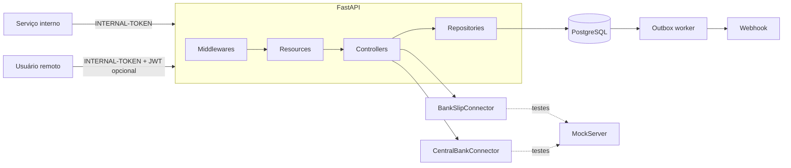
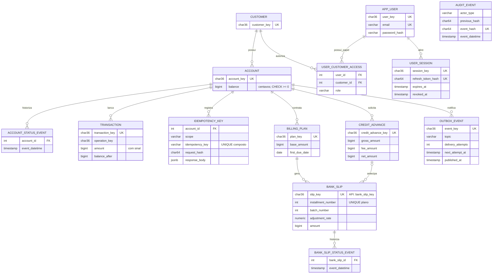
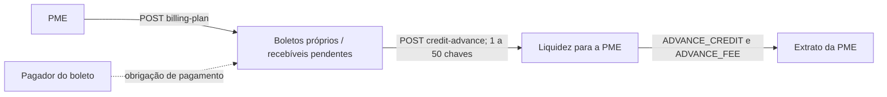

# RFC — BaaS PME: conta, cobrança e liquidez

| | |
|---|---|
| **Time** | Cairê Belo · Pedro Campanha |
| **Data** | 09/10/2026 |
| **Versão** | 2.8 — consolidação das entregas até T4.5 |

## Contextualização

### Entendendo o problema

Uma PME cobra mensalidades, recebe boletos, paga fornecedores e pode antecipar recebíveis para preservar caixa. O BaaS cadastra a PME e conta, movimenta dinheiro, emite boletos reajustados, antecipa recebíveis e entrega extrato. Sistemas internos usam credencial de serviço; usuários remotos operam conforme o papel na própria PME.

Dinheiro exige saldo não negativo, retentativa sem duplicação, boleto antecipado uma única vez e extrato que explique a projeção de saldo. Falhas violariam o caixa, duplicariam pagamento/crédito ou destruiriam rastreabilidade. Estão fora do escopo: baixa de boleto, estorno, múltiplas moedas, reajuste agendado, SLO/capacidade produtiva e instalação de Alertmanager/cAdvisor. Bloqueio/cancelamento, identidade, auditoria verificável, métricas, timeout, notificação pós-commit e precificação comercial versionada foram entregues.

Saques e transferências entre 20h e 6h, em `America/Sao_Paulo`, limitam cada operação a 100000 centavos; depósito não limita. Valores financeiros são centavos inteiros. O fluxo transacional e os testes concorrentes protegem saldo/ledger; a imutabilidade protegida diretamente pelo banco existe para `audit_event`. Expandir essa proteção a todo o ledger e reconciliar saldo independentemente é evolução P0 no plano.

### Explicando a solução de forma macro

FastAPI valida HTTP; controllers decidem e confirmam uma única transação PostgreSQL; repositories concentram consulta e lock. Saldo é projeção materializada: contas são travadas em ordem estável, saldo é validado já travado, lançamentos em centavos e saldo são gravados no mesmo commit. `Idempotency-Key`, hash do corpo e unicidade tornam retentativas seguras. MockServer isola conectores nos testes; outbox grava a intenção de notificar junto do fato e worker entrega após o commit. Contratos completos, erros e payloads estão em `DECISOES.md`; cobertura, benchmark e operação estão nos documentos referenciados pelo README.

- **Lock otimista** — descartado porque conflito na mesma conta repetiria operação financeira; duas contas tornam o conflito caro. Ganharia se disputa fosse rara.
- **`NUMERIC(14,2)`** — descartado porque o contrato aceitaria decimais e elevaria risco de `float`. Ganharia com fração de centavo.
- **Soft delete** — descartado porque esconde a história. Ganharia sob obrigação de apagar PII; então seria necessária anonimização.
- **Reajuste agendado** — descartado porque foge do ciclo HTTP determinístico. Ganharia para processamento massivo com worker próprio.

## Implementação

### Rotas

Exceto `/` e `/health_check`, as rotas exigem `INTERNAL-TOKEN`. Em rotas de conta, JWT é opcional para ator técnico; quando existe, sessão ativa e papel na PME são obrigatórios. Erros usam contrato próprio QIT `{title, description, translation, code}`, detalhado em `DECISOES.md`.

| Método | Caminho | O que faz | Entrada relevante | Saídas |
|---|---|---|---|---|
| `POST/GET` | `/customer`, `/customer/{key}` | Cria/consulta PME | nome, e-mail, CPF/CNPJ | `201/200`; `400` schema; `404`; `409` duplicidade; `422` documento |
| `POST/GET` | `/account`, `/account/{key}` | Abre/consulta conta e eventos | `customer_key` | `201/200`; `400`; `404` |
| `PUT` | `/account/{key}/block`, `/cancel` | Transição auditável | chave | `200`; `404`; `409` transição |
| `POST` | `/account/{key}/transaction` | Depósito, saque, transferência | tipo, centavos, destino, chave idempotente | Idempotente: `201`/replay; `400`, `404`, `409`, `422` |
| `GET` | `/account/{key}/transaction/{transaction_key}`, `/transactions` | Lançamento e extrato | chaves, página, limite, tipo | `200`; `400`; `404` sem IDOR |
| `POST/GET` | `/account/{key}/billing-plan`, `/billing-plan/{plan_key}` | Emite/consulta lote 1 | centavos, vencimento | `201/200`; `400`, `404`, `409`, `422`, `502` |
| `POST` | `.../billing-plan/{plan_key}/adjustment` | Emite lote 2 IPCA/IGPM | índice | `201`; `400`, `404`, `409`, `502` |
| `POST` | `/account/{key}/credit-advance` | Antecipa 1–50 boletos | chaves, chave idempotente | Idempotente: `201`; `400`, `404`, `409` |
| `POST` | `/pricing-policy` | Publica tarifa padrão ou por PME | operação, centavos, bps, PME opcional | `201`; `400`, `403`, `404` |
| `POST` | `/risk-policy` | Publica regra de risco/produto padrão ou por PME | habilitações e limites em centavos | `201`; `400`, `403`, `404` |
| `POST` | `/user`, `/auth/login|refresh|logout` | Usuário e sessões | PME, credenciais, refresh/JWT | `201/204`; `400`, `401`, `403`, `409` |
| `GET` | `/audit-events[/checkpoint]`, `/metrics` | Auditoria e métricas internas | n/a | `200`; `403` sem token |

### Banco de Dados (Somente diagrama)

### Fluxos

**Transferência — caminho feliz**

1. Resource valida corpo e `Idempotency-Key`; formato inválido devolve `400`.
2. Controller reserva chave por `UNIQUE(account_id, scope, idempotency_key)` e hash SHA-256; destino igual e limite noturno falham antes de lock.
3. Repository trava origem e destino em uma consulta `FOR NO KEY UPDATE ORDER BY id`; inexistente é `404`, status não aprovado é `409`.
4. Controller resolve a política comercial vigente (PME específica ou padrão), cria snapshot imutável de preço, valida saldo para valor+tarifa, grava `TRANSFER_OUT`, `TRANSFER_FEE` quando houver tarifa e `TRANSFER_IN` com mesmo `operation_key`, atualiza saldos e salva a resposta.
5. Um commit confirma tudo. Mesmo hash retorna corpo original com `Idempotent-Replayed: true`; hash diverso devolve `409`.

**Transferência — falha por saldo ou timeout**

1. Saldo insuficiente após lock devolve `422`; rollback inclui reserva idempotente, saldo e ledger não mudam.
2. Se cliente perde a resposta após commit, repete mesma chave e corpo. A unicidade espera a primeira transação e devolve a resposta persistida, sem segundo débito.

**Risco e habilitação comercial por PME**

1. Antes da emissão externa de boleto, a API rejeita `BILLING_PLAN` desabilitado. Antes de antecipar, valida produto, valor bruto e quantidade de boletos depois de travar os recebíveis. Antes de transferir, valida produto e teto por operação.
2. Para a transferência, depois das travas de conta em ordem de ID, uma trava transacional por `PME + data` serializa a atualização de `customer_daily_outgoing`. O limite diário conta o valor principal enviado; a tarifa comercial tem snapshot e lançamento próprios.
3. `risk_policy_snapshot` copia política, versão, pedido e, quando aplicável, consumo diário antes/depois. O mesmo snapshot é ligado ao fato financeiro e a auditoria registra a decisão. Nova política não altera fatos confirmados.

**Antecipação — caminho feliz e disputa**

1. A rota idempotente trava conta e boletos por `id`; exige conta aprovada, boletos pertencentes, `PENDING` e sem antecipação.
2. Calcula somente em inteiros a partir do snapshot de preço vigente: `gross = soma`, `fee = fixa + round_half_up(gross × bps / 10000)`, `net = gross - fee`; grava vínculo, crédito, tarifa, saldo e resposta no mesmo commit.
3. Duas solicitações concorrentes do mesmo boleto: a segunda vê o vínculo depois de esperar a trava e recebe `409 QIT001016`.

**Dois fluxos de produto — cobrança e liquidez**

O plano de cobrança cria os boletos que a PME apresentará a seus pagadores;
eles são recebíveis da própria PME. A antecipação não cria dívida nova nem
financia valor livre: somente transforma boletos próprios, `PENDING` e ainda
sem `credit_advance_id` em liquidez. O pagador é participante econômico da
cobrança, mas não possui cadastro, autenticação, baixa automática ou saldo
nesta versão da API. Assim, não há contrato de empréstimo, juros parcelados,
cronograma de amortização ou boleto para devedor de crédito no escopo.

**Cobrança, reajuste e falha externa**

1. Lote 1 valida conta/vencimento/centavos, chama emissão externa e grava plano, 12 boletos, eventos e a tarifa de emissão da PME em um commit. Essa tarifa é serviço do BaaS e não altera o valor que o pagador deve em cada boleto; o lote 2 também resolve a política vigente quando emitido.
2. Reajuste lê IPCA/IGPM como `Decimal` sem lock, trava plano, impede lote 2 e calcula parcelas 13–24 com half-up; referência externa é plano+lote.
3. Falha de conector devolve `502 QIT001009` sem escrita local. Aceite externo seguido de falha de commit é reconciliável pela referência determinística, mas é a janela inevitável entre sistemas. O reajuste mantém lock somente do plano durante emissão; reserva persistida é evolução P1.

**Bloqueio, auditoria e notificação**

1. Bloqueio/cancelamento grava evento de status, `audit_event` e `outbox_event` na mesma transação.
2. Worker usa `FOR UPDATE SKIP LOCKED`, lease e backoff, e envia webhook com `Idempotency-Key = event_key`.
3. Entrega é pelo menos uma vez; consumidor deduplica. A cadeia `audit_event` usa SHA-256, exportação/checkpoint e trigger contra `UPDATE`/`DELETE`; não é blockchain nem resiste a administrador do banco.

> ## Principal desafio
>
> - **Qual é:** preservar saldo e não duplicar lançamentos com concorrência e retentativa.
> - **Por que é difícil:** leitura/validação/gravação sem lock permite débito duplo; A→B e B→A podem deadlockar; timeout não revela commit.
> - **Como o desenho resolve:** lock pessimista ordenado por `id`, `CHECK (balance >= 0)`, ledger, saldo e resposta idempotente no mesmo commit; a chave única devolve o resultado confirmado. S7c exercita cinco vezes 40 transferências cruzadas, dez reenvios, antecipação dupla e último saldo. T4.5 registra método/ambiente, não SLO.
