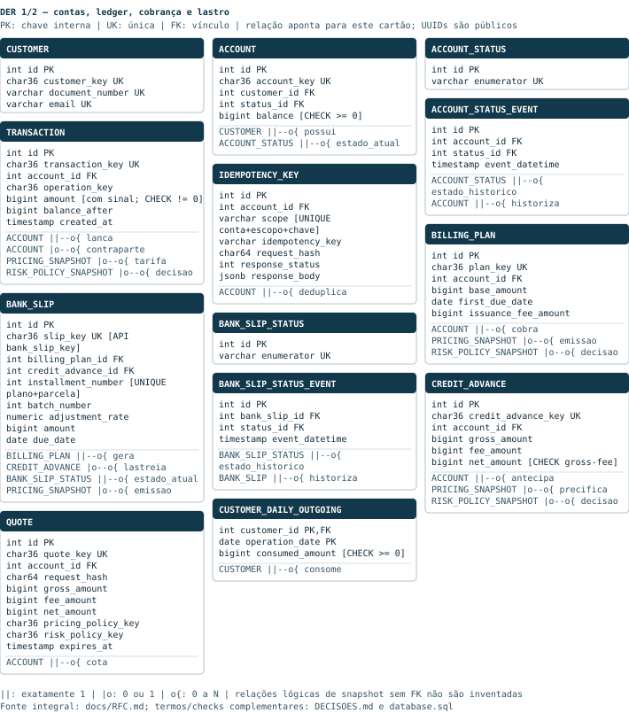
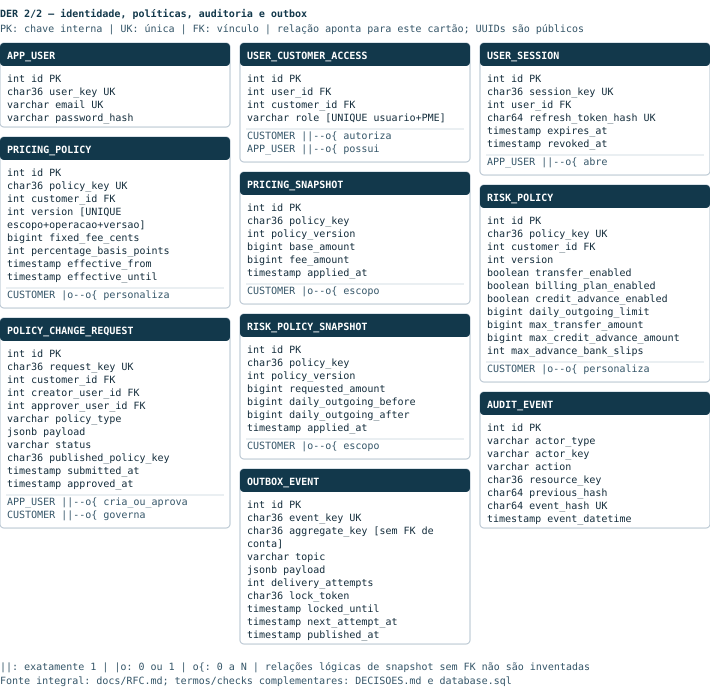

# RFC — BaaS PME: conta, cobrança e liquidez

| | |
|---|---|
| **Time / data / versão** | Cairê Belo · Pedro Campanha · 10/10/2026 · 3.4 · [RFC integral](../RFC.md) |

## Contextualização

### Entendendo o problema

A PME cobra, movimenta e antecipa recebíveis. Duplicar dinheiro/lastro ou perder história impede confiar no saldo. Entregamos essas operações com identidade, personalização e auditoria. Não há empréstimo, baixa automática, estorno, múltiplas moedas ou SLO. São **garantias verificadas e limitações conhecidas**; líquido positivo implementado, demais fronteiras de P0.4 pendentes.

### Explicando a solução de forma macro

Serviço HTTP modular + worker compartilham PostgreSQL; middleware → schema → resource → controller → repository → model/DTO; conectores/MockServer isolam I/O. Travas/commit/idempotência protegem dinheiro; auditoria/outbox acompanham fatos. Exceções: preço/risco nos repositories e SQL na auditoria. Não há gateway/frota de microserviços.

- **Microserviço por operação**: descartado por fragmentar ACID; ganharia com domínios/deploys independentes. **Lock otimista**: descartado por repetir decisões sob disputa; ganharia com baixa contenção.
- **Float/NUMERIC monetário**: float perde precisão; NUMERIC seria exato, mas centavos simplificam; ganharia com frações de centavo. **Soft delete**: oculta história; ganharia para dados descartáveis, não fatos financeiros.

## Implementação

### Rotas

Token interno obrigatório, exceto raiz/saúde; JWT presente valida PME/papel nas contas; propostas exigem OWNER. Bootstrap/políticas diretas/auditoria/métricas sem RBAC próprio. Erro QIT `{title, description, translation, code}`, não RFC 9457 integral. Globais: 403 token; 401 JWT/403 papel; 503 timeout SQL. Replay = UNIQUE(conta,escopo,chave)+hash+resposta; contratos em [DECISOES](../DECISOES.md).

| Método | Caminho | Função / idempotência | Entrada | Saídas (status e quando) |
|---|---|---|---|---|
| GET | `/` | Identifica | — | 200 |
| GET | `/health_check` | Liveness | — | 204 |
| POST | `/customer` | Cadastra | CPF/CNPJ, e-mail | 201; 400 schema; 409 duplicado; 422 documento |
| GET | `/customer/{customer_key}` | Consulta | UUID | 200; 404 ausente |
| POST | `/account` | Abre conta | PME | 201; 400 schema; 404 PME |
| GET | `/account/{account_key}` | Consulta | UUID | 200; 404 conta |
| PUT | `/account/{account_key}/block` | Bloqueia | OWNER* | 200; 404 conta; 409 estado |
| PUT | `/account/{account_key}/cancel` | Cancela | OWNER* | 200; 404 conta; 409 estado |
| POST | `/account/{account_key}/transaction` | Movimenta/replay | tipo, valor, destino, chave | 201; 400 contrato; 404 conta; 409 estado/chave/produto; 422 saldo/limite/destino; 503 retry |
| GET | `/account/{account_key}/transaction/{transaction_key}` | Lançamento | UUIDs | 200; 404 ausente/alheio |
| GET | `/account/{account_key}/transactions` | Extrato | página/limite/tipo | 200; 400 consulta; 404 conta |
| POST | `/account/{account_key}/billing-plan` | Lote 1 | base, data | 201; 400 schema; 404 conta; 409 estado/produto; 422 data/tarifa; 502 emissor |
| GET | `/account/{account_key}/billing-plan/{plan_key}` | Plano | UUIDs | 200; 404 ausente/alheio |
| POST | `/account/{account_key}/billing-plan/{plan_key}/adjustment` | Lote 2 | índice | 201; 400 schema; 404 plano; 409 lote/estado/produto; 422 tarifa; 502 conector |
| POST | `/account/{account_key}/credit-advance` | Antecipa/replay | boletos, chave | 201; 400 contrato; 404 lastro; 409 estado/chave/lastro/produto; 422 risco/líquido; 503 retry |
| POST | `/pricing-policy` | Preço direto | PME, tarifa | 201; 400 schema; 404 PME |
| POST | `/risk-policy` | Risco direto | PME, limites | 201; 400 schema; 404 PME |
| POST | `/account/{account_key}/quote` | Prévia | produto, valor/lastro | 201; 400 schema; 404 conta/lastro; 409 produto/lastro; 422 risco/líquido de antecipação |
| POST | `/policy-change-request` | DRAFT | política, OWNER | 201; 400 schema; 401 JWT; 403 vínculo; 404 PME |
| PUT | `/policy-change-request/{request_key}/submit` | Submete | criador | 200; 401 JWT; 403 vínculo; 404 proposta; 409 ator/estado |
| PUT | `/policy-change-request/{request_key}/approve` | Aprova | outro OWNER | 200; 401 JWT; 403 vínculo; 404 proposta; 409 ator/estado |
| POST | `/user` | Usuário | PME, senha, papel | 201; 400 schema/senha; 404 PME; 409 e-mail |
| POST | `/auth/login` | Nova sessão | credenciais | 201; 400 schema; 401 credenciais |
| POST | `/auth/refresh` | Rotaciona | refresh | 201; 400 schema; 401 inválido/usado |
| POST | `/auth/logout` | Revoga | JWT | 204; 401 sessão |
| GET | `/audit-events` | Cadeia | token | 200; 403 token |
| GET | `/audit-events/checkpoint` | Ponta | token | 200; 403 token |
| GET | `/metrics` | Métricas | token | 200; 403 token |

*OWNER se JWT presente. Escritas sem “replay” criam nova entidade/versão; estado/lote2/proposta respondem conflito na repetição; refresh é de uso único e logout recusa sessão revogada.

<!-- page -->

### Banco de Dados (Somente diagrama)

<!-- page -->

<!-- page -->

### Fluxos

> ## Principal desafio
>
> **Qual é:** manter saldo/ledger coerentes sob concorrência e resposta perdida. **Por que é difícil:** saldo lido sem trava autoriza débitos incompatíveis; timeout não revela commit. **Como resolvemos:** trava por ID interno, recarga, CHECK e confirmação conjunta de ledger/saldo/resposta idempotente. A garantia depende de toda escrita seguir esse caminho, não cobre administrador ou todas as falhas possíveis.

**Cadastro, dinheiro e estado**
1. Validar schema estrito/documento/duplicidade; criar UUID e eventos PENDING→APPROVED.
2. Conta travada recebe lançamento assinado; block/cancel gravam estado/evento/auditoria/outbox; CANCELLED terminal. Controller faz commit único.

**Falha:** 409 duplicado/estado, 422 documento/saldo; rollback sem espera por crédito futuro. Cancelar não liquida saldo/boletos automaticamente.

**Transferência, preço e risco**
1. Reservar idempotência; travar contas por ID crescente, `FOR NO KEY UPDATE`, compatível com KEY SHARE da FK; reler.
2. Resolver PME específica > padrão; tarifa = fixo + half-up(bruto×bps/10000). Snapshot congela escolha. Risco aplica habilitação/teto por operação/diário; advisory lock PME+data serializa consumo.
3. TRANSFER_OUT/IN/FEE compartilham operation_key; saldo, ledger, snapshots, consumo, auditoria e resposta confirmam juntos.

**Falha:** 409 produto/estado; 422 saldo/teto; nenhum consumo parcial. A→B/B→A sem ordem podem esperar circularmente; por menor ID primeiro uma aguarda a outra. É ID, nunca IP. Falta de saldo é negócio, não deadlock nem retry.

**Regra noturna:** acima de R$ 1.000 por saque/transferência é 422 entre 20h e 6h, America/Sao_Paulo, qualquer conta; depósito não limitado. Teto diário comercial conta principal transferido; data do runtime ainda precisa alinhamento ao fuso.

**Idempotência, timeout e retry**
1. SHA-256 canônico + UNIQUE(conta,escopo,chave) serializam reenvio. Mesmo corpo devolve 201 original e Idempotent-Replayed; corpo diferente dá 409; recusa desfaz reserva.
2. Só transação/antecipação retentam operação inteira, nova sessão/rollback, 40P01/40001, até duas tentativas totais. Não repetir 4xx, conector ou esperar dinheiro.

**Falha:** esgotamento 503/QIT001025; timeout SQL 503/QIT001024. Reenvio após resposta perdida mantém chave. Esperas: externo 1s/5s, banco 2s/10s, orçamento 15s; não é deadline global rígido.

**Cobrança, reajuste e antecipação**
1. Lote 1 emite 12 recebíveis da PME para pagadores externos, vencimentos mensais com fim de mês; tarifa de serviço separada. Lote 2 consulta IPCA/IGPM, trava plano, reajusta 13–24 com Decimal half-up e emite uma vez localmente.
2. Antecipação trava conta/boletos próprios PENDING não consumidos; soma bruto, aplica risco e valida tarifa/líquido antes do snapshot de preço. Persiste a escolha, credita bruto, debita tarifa positiva e vincula lastro no commit idempotente. PENDING não vira PAID por antecipar.

**Falha:** 502 externo desfaz escrita local, não emissão externa; lote 2 segura lock durante I/O e criação não tem replay. Lastro alheio/inexistente dá mesmo 404; usado dá 409; lista inválida desfaz toda tentativa. Não há empréstimo, amortização ou baixa do pagador.

**Líquido positivo implementado — subparte P0.4:** execução/cotação CREDIT_ADVANCE exigem bruto−tarifa > 0, após half-up; senão **422/QIT001030**, sem dinheiro/lastro/snapshots/reserva confirmados e sem retry de negócio. Bruto R$100: tarifa R$3 → R$97; R$99,99 → R$0,01; R$100/R$120 recusam. Saldo anterior R$500 permanece intacto. Tarifa R$120 pode valer para bruto R$1.000. Replay confirmado preserva resposta; CHECKs/migração protegem novas gravações sem reescrever legado. Testes HTTP/SQL em COBERTURA; demais itens 9.5 pendentes.

**Cotação e quatro olhos**
1. Quote de transferência/plano/antecipação dura 60s, persiste prévia sem reservar saldo/limite/lastro/preço. Execução recalcula; não aceita quote_key/tarifa do cliente.
2. OWNER cria DRAFT, criador submete PENDING_APPROVAL; outro OWNER aprova sob lock e publica nova versão no commit. Vigência anterior encerra; snapshots não são reprecificados.

**Falha:** pendente não vale, autoaprovação/repetição 409, papel/PME 403. Rotas diretas contornam aprovação; RETIRED sem transição entregue. Líquido de quote TRANSFER com tarifa alta permanece lacuna.

**Identidade e autorização**
1. Bcrypt (até 72 bytes UTF-8); login emite acesso 15min e refresh opaco rotativo, hash persistido, sessão máxima 8h. Dispositivos independentes, logout individual.
2. JWT presente: VIEWER lê/cota; OPERATOR movimenta; OWNER altera estado. Propostas exigem OWNER. Token interno técnico tem autoridade ampla e pode dispensar JWT nas contas.

**Falha:** credenciais/JWT 401, vínculo/papel 403; proposta com sessão revogada pode 403. Login não revela e-mail. Rate limit, rotação, provisionamento e gateway não entregues; UUID não substitui autorização.

**Extrato, auditoria e outbox**
1. Extrato ordena data+ID; valores com sinal contábil reconstroem saldo em conta estável. Lançamento alheio/inexistente dá mesmo 404. Offset não congela páginas com novas escritas.
2. SHA-256 encadeado sob lock global, cadeia/checkpoint exportados; ID sequencial administrativo é exceção documentada. Trigger impede UPDATE/DELETE só de audit_event; ledger/status/snapshots dependem da aplicação; administrador pode adulterar. Não é blockchain.
3. Outbox de block/cancel confirma com domínio; worker claim SKIP LOCKED+lease → webhook event_key → ack em transações separadas.

**Falha:** webhook agenda backoff; queda após aceite/lease vencido pode duplicar entrega; consumidor deve deduplicar. At-least-once, sem dead-letter/envelope versionado; não exactly-once externo.

**Pipelines e evidências**
1. CI push/PR: dependências/Compose/compilação → guardas → suíte completa com bootstrap isolado; JUnit/métricas/metadados preservados. Pytest cria DB/mock/portas livres e API às 21h; segunda API prova 19:59/20h, meia-noite, 05:59/6h e 12h, mais replay dia→noite. Sem escolher relógio por HTTP ou reiniciar desenvolvimento; cleanup só da sessão. Bootstrap/SQL/worker não são prova HTTP. Jornada: quatro olhos, cobrança/reajuste/cotação/antecipação, replay, dinheiro/extrato/estado/auditoria.
2. Logs JSON/X-Request-ID normais mascaram identificadores e não têm body; tracebacks podem conter SQL/URLs. Métricas internas: HTTP, QIT, replay, conectores, locks, retry, sessões/outbox; registry por processo, gauges persistidas. Regras de alertas são propostas, sem Prometheus/Alertmanager/cAdvisor instalado.
3. Benchmark 5×40 transferências cruzadas amostra CPU/RAM; observação local, não SLO. Resultados/datas/comandos: [COBERTURA](../COBERTURA.md), [BENCHMARK](../BENCHMARK.md), [ENTREGA](ENTREGA.md). CI/publicação confirmados em `1603118`; novas revisões exigem novo CI. Clone, aceite e ensaio do grupo pendentes. Legado sample_entity segue ativo; biblioteca não participa do produto. Detalhes preservados na RFC integral/DECISOES; demais itens 9.5 ficam fora deste trabalho.

